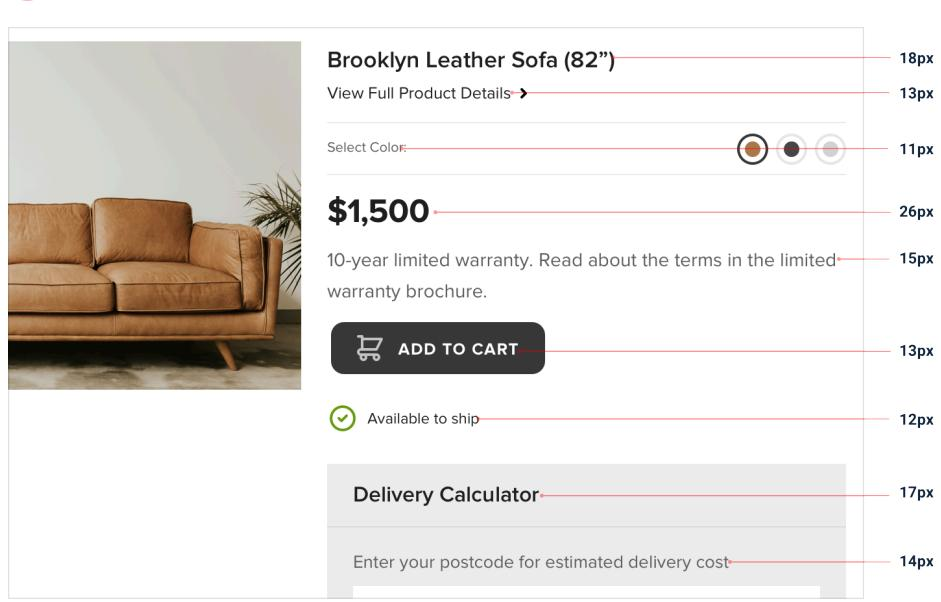
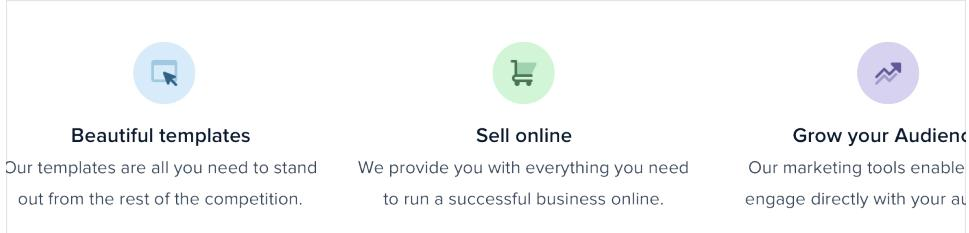
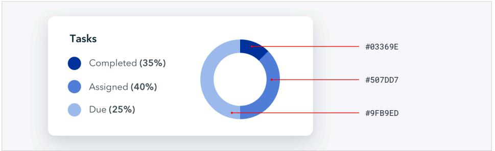
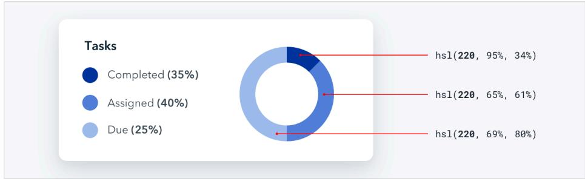
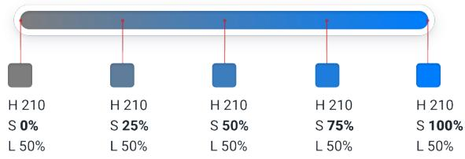
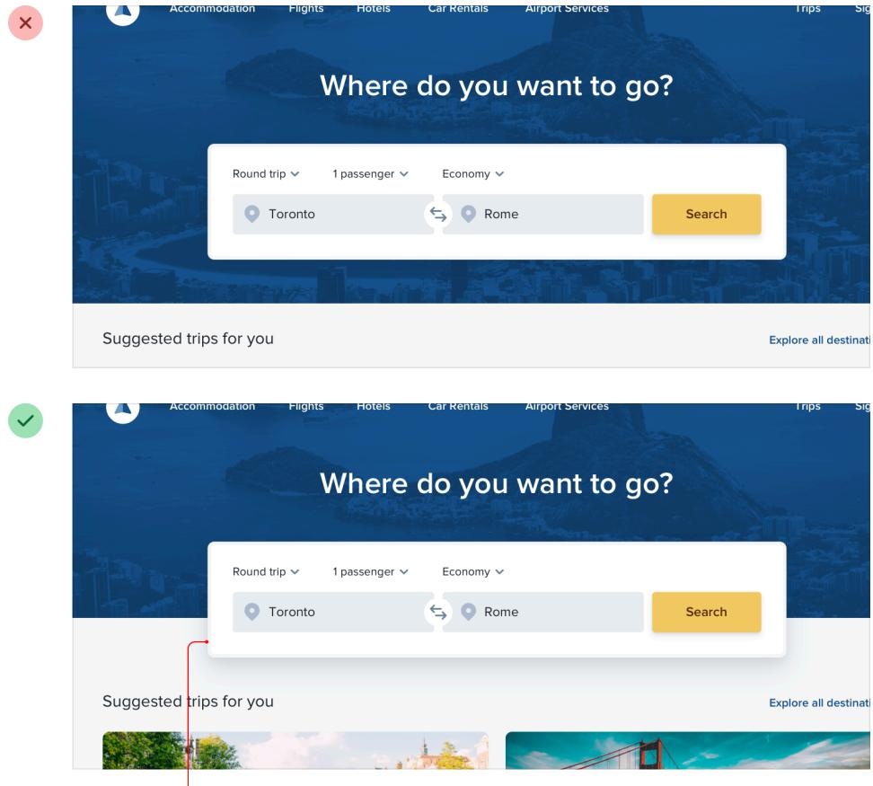
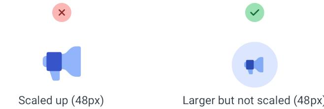
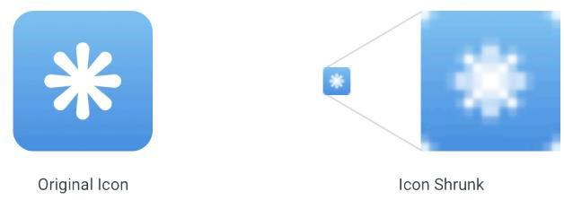

# **Contents**

| Starting from Scratch | 6 |
| --- | --- |
| Start with a feature, not a layout 7 |  |
| Detail comes later 10 |  |
| Don't design too much | 13 |
| Choose a personality | 17 |
| Limit your choices 24 |  |
| Hierarchy is Everything | 29 |
| Not all elements are equal | 30 |
| Size isn't everything 32 |  |
| Don't use grey text on colored backgrounds 36 |  |
| Emphasize by de-emphasizing 39 |  |
| Labels are a last resort 41 |  |
| Separate visual hierarchy from document hierarchy 46 |  |
| Balance weight and contrast 48 |  |

| Semantics are secondary | 52 |
| --- | --- |
| Layout and Spacing | 55 |
| Start with too much white space | 56 |
| Establish a spacing and sizing system | 60 |
| You don't have to fill the whole screen | 65 |
| Grids are overrated | 72 |
| Relative sizing doesn't scale | 79 |
| Avoid ambiguous spacing 83 |  |
| Designing Text | 87 |
| Establish a type scale 88 |  |
| Use good fonts | 94 |
| Keep your line length in check | 99 |
| Baseline, not center | 102 |
| Line-height is proportional | 105 |
| Not every link needs a color | 109 |
| Align with readability in mind | 111 |
| Use letter-spacing effectively | 115 |
| Working with Color | 118 |
| Ditch hex for HSL | 119 |
| You need more colors than you think | 123 |
| Define your shades up front | 129 |
| Don't let lightness kill your saturation | 133 |
| Greys don't have to be grey | 139 |
| Accessible doesn't have to mean ugly | 142 |
| Don't rely on color alone | 146 |

| Creating Depth |  | 149 |
| --- | --- | --- |
| Emulate a light source | 150 |  |
| Use shadows to convey elevation | 158 |  |
| Shadows can have two parts | 163 |  |
| Even flat designs can have depth |  | 167 |
| Overlap elements to create layers | 170 |  |
| Working with Images |  | 173 |
| Use good photos |  | 174 |
| Text needs consistent contrast |  | 176 |
| Everything has an intended size |  | 181 |
| Beware user-uploaded content |  | 187 |
| Finishing Touches |  | 191 |
| Supercharge the defaults |  | 192 |
| Add color with accent borders | 195 |  |
| Decorate your backgrounds | 198 |  |
| Don't overlook empty states |  | 203 |
| Use fewer borders |  | 206 |
| Think outside the box | 210 |  |
| Leveling Up |  | 215 |

# **Starting from Scratch**

### **Start with a feature, not a layout**

When you start the design for a new app idea, what do you design first? If it's the navigation bar at the top of the page, you're making a mistake.

The easiest way to find yourself frustrated and stuck when working on a new design is to start by trying to "design the app." When most people think about "designing the app", they're thinking about the *shell*.

*Should it have a top nav, or a sidebar? Should the navigation items be on the left, or on the right? Should the page content be in a container, or should it be full-width? Where should the logo go?*

The thing is, an "app" is actually a collection of *features*. Before you've designed a few features, you don't even have the information you need to make a decision about how the navigation should work. No wonder it's frustrating!

Instead of starting with the shell, start with a piece of actual functionality.

For example, say you're building a flight booking service. You could start with a feature like "searching for a flight".

Your interface will need:

- A field for the departure city
- A field for the destination city
- A field for the departure date
- A field for the return date
- A button to perform the search

#### Start with that.

| 0 0 0 |  |
| --- | --- |
| ← → C △ |  |
|  | Find the best deals on flights right now |
|  | Leaving from ... |
|  | Going to ... |
|  | Depart Return |
|  | Search Flights |

Hell, you might not even need that other stuff anyways — it worked for Google.

### **Detail comes later**

In the earliest stages of designing a new feature, it's important that you don't get hung up making low-level decisions about things like typefaces, shadows, icons, etc.

That stuff will all matter eventually, but it doesn't matter right now.

If you have trouble ignoring the details when working in a high fidelity environment like the browser or your favorite design tool, one trick Jason Fried of Basecamp likes to use is to design on paper using a thick Sharpie.

Obsessing over little details just isn't possible with a Sharpie, so it can be a great way to quickly explore a bunch of different layout ideas.

### **Hold the color**

Even when you're ready to refine an idea in higher fidelity, resist the temptation to introduce color right away.

By designing in grayscale, you're forced to use spacing, contrast, and size to do all of the heavy lifting.

| Choose the amount of storage that's right for you. |  |  | Bill yearly | Bill monthly |
| --- | --- | --- | --- | --- |
| Full name |  |  | ESSENTIAL | V |
|  |  |  | 200 GB of storage | $10 / mo |
| Email |  |  |  |  |
|  |  |  | PRO |  |
| Password |  |  | 1 TB of storage | $20 / mo |
| Card number | MM/YY | CVC |  |  |
|  |  |  | PREMIUM |  |
| CREATE ACCOUNT |  |  | 2 TB of storage | $40 / mo |

It's a little more challenging, but you'll end up with a clearer interface with a strong hierarchy that's easy to enhance with color later.

| Choose the amount of storage that's right for you. |  |  | Bill yearly Bill monthly |
| --- | --- | --- | --- |
| Full name |  | ESSENTIAL | > |
|  |  | 200 GB of storage | $10 / mo |
| Email |  |  |  |
| Password |  | PRO 1 TB of storage | $20 / mo |
| Card number | MM/YY CVC | PREMIUM |  |
| CREATE ACCOUNT |  | 2 TB of storage | $40 / mo |

### **Don't over-invest**

The whole point of designing in low-fidelity is to be able to move fast, so you can start building the real thing as soon as possible.

Sketches and wireframes are disposable — users can't do anything with static mockups. Use them to explore your ideas, and leave them behind when you've made a decision.

You don't need to design every single feature in an app before you move on to implementation; in fact, it's better if you don't.

Figuring out how every feature in a product should interact and how every edge case should look is really hard, especially in the abstract.

*How should this screen look if the user has 2000 contacts?*

*Where should the error message go in this form?*

*How should this calendar look when there are two events scheduled at the same time?*

You're setting yourself up for frustration by trying to figure this stuff out using only a design tool and your imagination.

### **Work in cycles**

Instead of designing everything up front, work in short cycles. Start by designing a simple version of the next feature you want to build.

Once you're happy with the basic design, *make it real*.

You'll probably run into some unexpected complexity along the way, but that's the point — it's a lot easier to fix design problems in an interface you can actually use than it is to imagine every edge case in advance.

Iterate on the working design until there are no more problems left to solve,

then jump back into design mode and start working on the next feature.

Don't get overwhelmed working in the abstract. Build the real thing as early as possible so your imagination doesn't have to do all the heavy lifting.

#### **Be a pessimist**

Don't imply functionality in your designs that you aren't ready to build.

For example, say you're working on a comment system for a project management tool. You know that one day, you'd like users to be able to attach files to their comments, so you include an attachments section in your design.

| Add a new comment |  |
| --- | --- |
| Type your message ... |  |
| Attach files by dragging & dropping or selecting them. |  |
| ? Some HTML is OK. | Post Comment |

You get deep into implementation only to discover that supporting attachments is going to be *a lot* more work than you anticipated. There's no way you have time to finish it right now, so the whole commenting system sits on the backburner while you take care of other priorities.

The thing is, a comment system with no attachments would still have been better than no comment system at all, but because you planned to include it from day one you've got nothing you can ship.

When you're designing a new feature, **expect it to be hard to build.** Designing the smallest useful version you can ship reduces that risk considerably.

| Add a new comment |  |
| --- | --- |
| Type your message... |  |
| (2) Some HTML is OK. | Post Comment |

If part of a feature is a "nice-to-have", **design it later**. Build the simple version first and you'll always have something to fall back on.

Every design has some sort of personality. A banking site might try to communicate *secure* and *professional*, while a trendy new startup might have a design that feels fun and *playful*.

On the surface, giving a design a particular personality might sound abstract and handwavy, but a lot of it is determined by a few solid, concrete factors.

### **Font choice**

Typography plays a huge part in determining how a design feels.

If you want an elegant or classic look, you might want to incorporate a serif typeface in your design:

For a playful look, you could use a rounded sans serif:

If you're going for a plainer look, or want to rely on other elements to provide the personality, a neutral sans serif works great:

### **Color**

There's a lot of science out there on the psychology of color, but in practice, you really just need to pay attention to how different colors feel to you.

Blue is safe and familiar — nobody ever complains about blue:

Gold might say "expensive" and "sophisticated":

Pink is a bit more fun, and not so serious:

While trying to choose colors using *only* psychology isn't super practical — a lot of it is just about what looks good to you — it can be helpful to think about when you're trying to understand why you think a color is the right fit.

#### **Border radius**

As small of a detail as it sounds, if and how much you round the corners in your design can have a big impact on the overall feel.

A small border radius is pretty neutral, and doesn't really communicate much of a personality on its own:

A large border radius starts to feel more playful:

…while no border radius at all feels a lot more serious or formal:

Whatever you choose, it's important to stay consistent. Mixing square corners with rounded corners in the same interface almost always looks worse than sticking with one or the other.

### **Language**

While not a visual design technique per se, the words you use in an interface have a massive influence on the overall personality.

Using a less personal tone might feel more official or professional:

…while using friendlier, more casual language makes a site feel, well, friendlier:

Words are everywhere in a user interface, and choosing the right ones is just as (if not more) important than choosing the right color or typeface.

### **Deciding what you actually want**

A lot of the time you'll probably just have a gut feeling for the personality you're going for. But if you don't, a great way to simplify the decision is to take a look at other sites used by the people you want to reach.

If they are mostly pretty "serious business", maybe that's how your site should look too. If they are more playful with a bit of humor, maybe that's a better direction to take.

Just try not to borrow too much from direct competitors, you don't want to look like a second-rate version of something else.

Having millions of colors and thousands of fonts to choose from might sound nice in theory, but in practice it's usually a paralyzing curse.

And it's not just fonts and colors, either — you can easily waste time agonizing over almost any minor design decision.

*Should this text be 12px or 13px? Should this box shadow have a 10% opacity or a 15% opacity? Should this avatar be 24px or 25px tall? Should I use a medium font weight for this button or semibold? Should this headline have a bottom margin of 18px or 20px?*

When you're designing without constraints, decision-making is torture because there's always going to be more than one right choice.

For example, these buttons all have different background colors, but it's almost impossible to tell the difference between them by just looking at them.

How are you supposed to make a confident decision if none of these would really be bad choices?

### **Define systems in advance**

Instead of hand-picking values from a limitless pool any time you need to make a decision, *start with a smaller set of options*.

Don't reach for the color picker every time you need to pick a new shade of blue — choose from a set of 8-10 shades picked out ahead of time.

Similarly, don't tweak a font size one pixel at a time until it looks perfect. Define a restrictive type scale in advance and use that to make any future font size decisions.

| 12px | The quick brown fox jumps over the lazy dog |
| --- | --- |
| 14px | The quick brown fox jumps over the lazy dog |
| 16px | The quick brown fox jumps over the lazy dog |
| 18px | The quick brown fox jumps over the lazy dog |
| 20px | The quick brown fox jumps over the lazy dog |
| 24px | The quick brown fox jumps over the lazy dog |
| 32px | The quick brown fox jumps over the lazy dog |
| 48nx | The quick brown fox jumps over th |

When you build systems like this, you only have to do the hard work of picking the initial values *once* instead of every time you're designing a new piece of UI. It's a bit more work up front, but it's worth it — it'll save you a ton of decision fatigue down the road.

### **Designing by process of elimination**

When you're designing using a constrained set of values, decision-making is a lot easier because there are a lot fewer "right" choices.

For example, say you're trying to choose a size for an icon. You've defined a sizing scale in advance where your only small-to-medium sized options are 12px, 16px, 24px, and 32px.

To pick the best option, start by taking a guess at which one will look best, maybe 16px. Then try the values on either side (12px and 24px) for comparison.

Chances are, two of those options will seem like *obviously* bad choices. If it's the options on the outside, you're done — the middle option is the only good choice.

If one of the outer options looks best, do another comparison using that option as the "middle" value and make sure there's not a better choice.

This approach works for anything where you've defined a system. When you're limited to a set of options that all look noticeably different, picking the best one is a piece of cake.

### **Systematize everything**

The more systems you have in place, the faster you'll be able to work and the less you'll second guess your own decisions.

You'll want systems for things like:

- Font size
- Font weight
- Line height
- Color
- Margin
- Padding
- Width
- Height
- Box shadows
- Border radius
- Border width
- Opacity

…and anything else you run into where it feels like you're laboring over a lowlevel design decision.

You don't have to define all of this stuff ahead of time, just make sure you're approaching design with a system-focused mindset. Look for opportunities to introduce new systems as you make new decisions, and try to avoid having to make the same minor decision twice.

Designing with systems is going to be a recurring theme throughout this book, and in later chapters we'll talk about building a lot of these systems in finer detail.

# **Hierarchy is Everything**

### **Not all elements are equal**

When you think of visual design as "styling things so they look good", it's easy to see why it might feel hard to achieve without innate artistic talent. But it turns out that one of the biggest factors in making something "look good" has nothing to do with superficial styling at all.

*Visual hierarchy* refers to how important the elements in an interface appear in relation to one another, and it's the most effective tool you have for making something feel "designed".

When everything in an interface is competing for attention, it feels noisy and chaotic, like one big wall of content where it's not clear what actually matters:

| Dashboard |  | Quote | Buy/Sell | Orders | Transfers | Watchlists |  |  |  |
| --- | --- | --- | --- | --- | --- | --- | --- | --- | --- |
| Overview | As of December 11, 2018, 8:00 AM PT |  |  |  |  |  |  |  |  |
| Total Balance: $16,412.92 +$648.83 |  |  | Investments: $15,606.14 +$648.83 |  |  | Cash: $806.78 |  |  |  |
| Holdings Activity | Performance |  | Gain & Loss |  |  |  |  |  |  |
| Name | Quantity | Price | Avg Cost | Mkt Value | Gain/Loss | Gain/Loss% | % of Portfolio | Buy/Sell |  |
| TDB900 - TD CDN INDX -E ... | 140.143 | $25.70 | $24.49 | $3,601.68 | +$170.00 | +4.95% | 10.10% | Buy | Sell |
| TDB902 - TD US INDX CS - ... | 65.218 | $54.86 | $51.95 | $3,577.86 | +$189.70 | +5.60% | 12.90% | Buy | Sell |
| TDB909 - TD CD BD IDX-E .. | 415.872 | $11.64 | $11.63 | $4,840.75 | -$6.01 | -0.12% | 8.00% | Buy | Sell |
| TDB911 - TD INTL IDX E SE ... | 271.861 | $13.19 | $12.15 | $3,585.85 | +$283.04 | +8.57% | 12.00% | Buy | Sell |

When you deliberately de-emphasize secondary and tertiary information, and make an effort to highlight the elements that are most important, the result is immediately more pleasing, even though the color scheme, font choice, and layout haven't changed:

| > |  | Dashboard | Quote | Buy/Sell | Orders | Transfers | Watchlists |  |  |
| --- | --- | --- | --- | --- | --- | --- | --- | --- | --- |
| Overview |  |  |  |  |  |  |  | As of December 11, 2018, 8:00 AM PT |  |
| TOTAL BALANCE |  |  |  | INVESTMENTS |  |  | CASH $806.78 |  |  |
| $16,412.92 |  |  |  | 15,606.14 |  |  |  |  |  |
| +$648.83 |  |  |  | +$648.83 |  |  |  |  |  |
| Holdings | Activity | Performance | Gain & Loss |  |  |  |  |  |  |
| NAME |  | QUANTITY | PRICE | AVG COST | MKT VALUE | GAIN/LOSS | % OF PORTFOLIO | BUY/SELL |  |
| TDB900 TD CDN INDX -E /NLFRAC |  | 140.143 | $25.70 | $24.49 | $3,601.68 | +$170.00 +4.95% | 10.10% | Buy | Sell |
|  |  | 65.218 | $54.86 | $51.95 | $3,577.86 |  | 12.90% | Buy | Sell |
| TDB909 TD CD BD IDX-E SE/NLFRAC |  | 415.872 | $11.64 | $11.63 | $4,840.75 | +$6.01 +0.12% | 8.00% | Buy | Sell |
| TDB902 |  |  |  |  |  | +$189.70 |  |  |  |
| TD US INDX CS -E /NLFRAC |  |  |  |  |  | +5.60% |  |  |  |

So how do you actually make this happen? In the following chapters, we'll cover a number of specific strategies you can use to introduce hierarchy into your designs.

Relying too much on font size to control your hierarchy is a mistake — it often leads to primary content that's too large, and secondary content that's too small.

Instead of leaving all of the heavy lifting to font size alone, try using font weight or color to do the same job.

For example, making a primary element bolder lets you use a more

reasonable font size, and often does a better job at communicating its importance anyways:

Similarly, using a softer color for supporting text instead of a tiny font size makes it clear that the text is secondary while sacrificing less on readability:

Try and stick to two or three colors:

- A dark color for primary content (like the headline of an article)
- A grey for secondary content (like the date an article was published)
- A lighter grey for tertiary content (maybe the copyright notice in a footer)

Similarly, two font weights are usually enough for UI work:

- A normal font weight (400 or 500 depending on the font) for most text
- A heavier font weight (600 or 700) for text you want to emphasize

Stay away from font weights under 400 for UI work — they can work for large headings but are too hard to read at smaller sizes. If you're considering using a lighter weight to de-emphasize some text, use a lighter color or smaller font size instead.

### **Don't use grey text on colored backgrounds**

Making text a lighter grey is a great way to de-emphasize it on white backgrounds, but it doesn't look so great on colored backgrounds.

That's because the effect we're actually seeing with grey on white is *reduced contrast*.

Making the text closer to the background color is what actually helps create hierarchy, not making it light grey.

You might think that the easiest way to achieve this is to use white text and reduce the opacity:

While this *does* reduce the contrast, it often results in text that looks dull, washed out, and sometimes even disabled.

Even worse, using this approach on top of an image or pattern means the background will show through the text:

A better approach is to *hand-pick a new color*, based on the background color.

Choose a color with the same hue, and adjust the saturation and lightness until it looks right to you:

Hand-picking a color this way makes it easy to reduce the contrast without the text looking faded.

## **Emphasize by de-emphasizing**

Sometimes you'll run into a situation where the main element of an interface isn't standing out enough, but there's nothing you can add to it to give it the emphasis it needs.

For example, despite trying to make this active nav item "pop" by giving it a different color, it still doesn't really stand out compared to the inactive items:

| × |  |  |  |  |
| --- | --- | --- | --- | --- |
| b | Dashboard | Orders | Products | Discounts |
| Orders |  |  |  |  |

When you run into situations like this, instead of trying to further emphasize the element you want to draw attention to, figure out how you can de*emphasize* the elements that are competing with it.

In this example, you could do that by giving the inactive items a softer color so they sit more in the background:

You can apply this thinking to bigger pieces of an interface as well. For

example, if a sidebar feels like it's competing with your main content area, don't give it a background color — let the content sit directly on the page background instead:

| × FILGINES HOREIS | ventures | Deals IVIOTE |  | FILGINS | HOREIS | Venteres Deals IVIOTE |  |
| --- | --- | --- | --- | --- | --- | --- | --- |
| STEP 1 OF 5 Your Itinerary |  | Your Itinerary |  | STEP 1 OF 5 Your Itinerary |  | Your Itinerary |  |
|  |  | 0 Round-trip |  |  |  | 0 Round-trip | . ) One- |
| Cabin Selection |  |  |  | Cabin Selection |  |  |  |
| Passenger Details |  | From? |  | Passenger Details |  | From? |  |
| Order Confirmation |  |  |  | Order Confirmation |  |  |  |
| Completion |  | I Depart |  | Completion |  | Depart |  |
|  |  | PASSENGERS |  |  |  | PASSENGERS |  |
|  |  | Adults | Chilk |  |  | Adults | Children (0-1 |
|  |  | TERMS & CONDITIONS |  |  |  | TERMS & CONDITIONS |  |

Put down the accessibility pitchfork — this isn't about forms.

When presenting data to the user (especially data from the database), it's easy to fall into the trap of displaying it using a naive *label: value* format.

The problem with this approach is that it makes it difficult to present the data with any sort of hierarchy; every piece of data is given equal emphasis.

### **You might not need a label at all**

In a lot of situations, you can tell what a piece of data is just by looking at the format.

For example, *janedoe@example.com* is an email address, *(555) 765-4321* is a phone number and *$19.99* is a price.

When the format isn't enough, the context often is. When you see the phrase *"Customer Support"* listed below someone's name in an employee directory,

you don't need a label to make the connection that that is the department the person works in.

When you're able to present data without labels, it's much easier to emphasize important or identifying information, making the interface easier to use while at the same time making it feel more "designed".

#### **Combine labels and values**

Even when a piece of data isn't completely clear without a label, you can often avoid adding a label by adding clarifying text to the value.

For example, if you need to display inventory in an e-commerce interface, instead of "In stock: 12", try something like "12 left in stock".

If you're building a real estate app, something like "Bedrooms: 3" could simply become "3 bedrooms".

When you're able to combine labels and values into a single unit, it's much easier to give each piece of data meaningful styling without sacrificing on clarity.

#### **Labels are secondary**

Sometimes you really do need a label; for example when you're displaying multiple pieces of similar data and they need to be easily scannable, like on a dashboard.

In these situations, add the label, but treat it as supporting content. The data itself is what matters, the label is just there for clarity.

De-emphasize the label by making it smaller, reducing the contrast, using a lighter font weight, or some combination of all three.

### **When to emphasize a label**

If you're designing an interface where you know the user will be *looking for* the label, it might make sense to emphasize the label instead of the data.

This is often the case on information-dense pages, like the technical specifications of a product.

If a user is trying to find out the dimensions of a smartphone, they're probably scanning the page for words like "depth", not "7.6mm".

| Dimensions | Height: 2.31 inches (58.6 mm) |
| --- | --- |
|  | Width: 4.87 inches (123.8 mm) |
|  | Depth: 0.30 inch (7.6 mm) |
| Power and Battery | Talk time: Up to 8 hours on 3G |

Don't de-emphasize the data too much in these scenarios; it's still important information. Simply using a darker color for the label and a slightly lighter color for the value is often enough.

### **Separate visual hierarchy from document hierarchy**

It's important to use semantic markup when building for the web, which means you'll often be using heading tags like h1, h2, or h3 if you decide to add a title to part of an interface.

By default, web browsers assign progressively smaller font sizes to heading elements, so an h1 is pretty large, and an h6 is pretty small. This can be helpful for document-style content like articles or documentation, but it can encourage some bad decisions in application UIs.

Using an h1 tag to add a title like *Manage Account* to a page makes perfect sense semantically, but because we're trained to believe that h1 elements should be big, it's easy to fall into the trap of making those titles bigger than they really need to be.

| -Manage Account |  |  |  |  |  |
| --- | --- | --- | --- | --- | --- |
| Account | Applications | Billing | Password | Notifications |  |
| Profile |  |  | First Name |  | Last Nam |
| This information will be shown publicly so |  |  |  |  |  |

A lot of the time, section titles act more like *labels* than headings — they are supportive content, they shouldn't be stealing all the attention.

Usually the *content* in that section should be the focus, not the title. That means that a lot of the time, titles should actually be pretty small:

| •Manage Account |  |  |  |  |  |
| --- | --- | --- | --- | --- | --- |
| Account | Applications | Billing | Password | Notifications |  |
| Profile | This information will be shown publicly so |  | First Name |  | Last Nam |

Taken to the extreme, you might even include section titles in your markup for accessibility reasons but *completely hide* them visually because the content speaks for itself.

Don't let the element you're using influence how you choose to style it pick elements for semantic purposes and style them however you need to create the best visual hierarchy.

The reason bold text feels emphasized compared to regular text is that bold text covers more surface area — in the same amount of space, more pixels are used for text than for the background.

So why is this interesting? Well it turns out that the relationship between surface area and hierarchy has implications on other elements in a UI as well.

#### **Using contrast to compensate for weight**

One of the places understanding this relationship becomes important is when working with icons.

Just like bold text, icons *(especially solid ones)* are generally pretty "heavy" and cover a lot of surface area. As a result, when you put an icon next to some text, the icon tends to feel emphasized.

| × BROWSE | PLAYLIST |  |
| --- | --- | --- |
| S Charts | Vibes |  |
| t Genres | Curated by Eric Dorsey · 60 songs, 5 hr 50 min |  |
| (S New Releases | PLAY |  |
| E Recommended |  |  |
| YOUR LIBRARY | + Love Me | Yuki Ame |
| Recently Played | + Buried | Ted Jasper |

Unlike text, there's no way to change the "weight" of an icon, so to create balance it needs to be de-emphasized in some other way.

A simple and effective way to do this is to lower the contrast of the icon by giving it a softer color.

| BROWSE | PLAYLIST |  |
| --- | --- | --- |
| Charts | Vibes |  |
| 00 Genres | Curated by Eric Dorsey • 60 songs, 5 hr 50 min |  |
| (2) New Releases | PLAY |  |
| Recommended |  |  |
| YOUR LIBRARY | + Love Me | Yuki Ame |
| Recently Played | + Buried | Ted Jasper |

This works anywhere you need to balance elements that have different weights. Reducing the contrast works like a counterbalance, making heavier elements feel lighter even though the weight hasn't changed.

#### **Using weight to compensate for contrast**

Just like how reducing contrast helps to de-emphasize heavy elements, increasing weight is a great way to add a bit of emphasis to low contrast elements.

This is useful when things like thin 1px borders are too subtle using a soft color, but darkening the color makes the design feel harsh and noisy.

Making the border a bit heavier by increasing the width helps to emphasize it without losing the softer look:

| Amanda Wagner | 8h ago | Human Resources Specialist |
| --- | --- | --- |
| Join us on November 27th for our 1st Dribbble meetup in Waterloo! Calling all | designers, UI/UXers, illustrators and other creatives from the KW and surrounding |  |
| area together to talk shop, mingle, and walk away with some great swag! |  |  |
| 23 | 17 | Share |
| Kimberly Kennedy | 8h ago | Sr. Front-End Developer |
| Had an inspiring two days at KiteTail HQ learning from the best design thinkers in | the biz. Can't wait to start playing with some great new ideas. |  |
| 45 | 17 | Share |
| Adam Henderson | 8h ago | Product Designer |

### **Semantics are secondary**

When there are multiple actions a user can take on a page, it's easy to fall into the trap of designing those actions based purely on semantics.

Semantics are an important part of button design, but that doesn't mean you can forget about hierarchy.

Every action on a page sits somewhere in a pyramid of importance. Most pages only have one true primary action, a couple of less important secondary actions, and a few seldom used tertiary actions.

When designing these actions, it's important to communicate their place in the hierarchy.

- **Primary actions should be obvious.** Solid, high contrast background colors work great here.
- **Secondary actions should be clear but not prominent.** Outline styles or lower contrast background colors are great options.
- **Tertiary actions should be discoverable but unobtrusive.** Styling these actions like links is usually the best approach.

When you take a hierarchy-first approach to designing the actions on page, the result is a much less busy UI that communicates more clearly:

### **Destructive actions**

Being destructive or high severity doesn't automatically mean a button should be big, red, and bold.

If a destructive action isn't the primary action on the page, it might be better to give it a secondary or tertiary button treatment.

Combine this with a confirmation step where the destructive action actually is the primary action, and apply the big, red, bold styling there.

| × Deactivate account |
| --- |
| Are you sure you want to deactivate your account? By doing this you will lose all of your saved data and will not be able to retrieve it. |
| Cancel Deactivate |

# **Layout and Spacing**

One of the easiest ways to clean up a design is to simply give every element a little more room to breathe.

| × Set up Two-Factor Authentication Every time you sign in to your account, you will need your password and verification code |  | STEP 1 OF 3 |  |
| --- | --- | --- | --- |
| Setup your phone Enter the phone number you would like to use. Country Phone Number |  |  |  |
| �� Canada > | +1 (255) 555-5555 (v) | Next Step |  |
| Set up Two-Factor Authentication Every time you sign in to your account, you will need your password and verification code |  |  | STEP 1 OF 3 |
| Setup your phone Enter the phone number you would like to use. |  |  |  |
| Country | Phone Number |  |  |
| �� Canada > | +1 (255) 555-5555 | (v) | Next Step |

Sounds simple enough, right? So how come we don't usually do it?

#### **White space should be removed, not added**

When designing for the web, white space is almost always *added* to a design — if something looks little too cramped, you add a bit of margin or padding until things look better.

| × | 50 customer reviews |  |
| --- | --- | --- |
|  | 5 star | 56% |
|  | 4 star | 20% |
|  | 3 star | 14% |
|  | 2 star | 2% |
|  | 1 star | 8% |
|  | Review this product |  |
|  | Share your thoughts with other customers |  |
|  | Write a review |  |
| ? |  |  |
|  | 50 customer reviews |  |
|  | 5 star | 56% |
|  | 4 star | 20% |
|  | 3 star | 14% |
|  | 2 star | 2% |
|  | 1 star | 8% |
|  | Review this product |  |
|  | Share your thoughts with other customers |  |
|  | Write a review |  |

The problem with this approach is that elements are only given the minimum amount of breathing room necessary to not look *actively bad*. To make something actually look *great*, you usually need more white space.

A better approach is to start by giving something *way too much* space, then remove it until you're happy with the result.

| × |  |  |  |
| --- | --- | --- | --- |
| 50 customer reviews |  |  |  |
| 5 star | 56% |  |  |
| 4 star | 20% |  |  |
| 3 star | 14% |  |  |
| 2 star ● | 2% |  |  |
| 8% | 1 star |  |  |
| Review this product | Share your thoughts with other customers |  |  |
| Write a review |  |  |  |
| 50 customer reviews |  |  |  |
| 56% | 5 star | 4 star | 20% |
| 14% | 3 star | 2% |  |
| 2 star | 8% |  |  |
| 1 star |  |  |  |
| Review this product | Share your thoughts with other customers |  |  |
| Write a review |  |  |  |

You might think you'd end up with too much white space this way, but in practice, what might seem like "a little too much" when focused on an individual element ends up being closer to "just enough" in the context of a complete UI.

### **Dense UIs have their place**

While interfaces with a lot of breathing room almost always feel cleaner and simpler, there are certainly situations where it makes sense for a design to be much more compact.

For example, if you're designing some sort of dashboard where a lot of information needs to be visible at once, packing that information together so it all fits on one screen might be worth making the design feel more busy.

| Game Summary |  |  |  |  |  |  |  |  |  |
| --- | --- | --- | --- | --- | --- | --- | --- | --- | --- |
| + Canada | 3886 | United States |  |  |  |  |  |  |  |
| TEAM STATS |  |  | # | Forwards | G | A | P | +/- | PIM |
| SOG | FO% | PP | 71 | W. Tran | O | O | O | O | O |
| 30 | 50% | 0/1 |  |  |  |  |  |  |  |
|  |  |  | 15 | M. Hoffman | O | O | O | O | O |
| PIM | HITS | вгкг |  |  |  |  |  |  |  |
| 6 | 36 | 12 | 67 | T. Valdez | O | O | O | O | O |
|  |  |  | 38 | H. Austin | O | 1 | O | O | O |
| SCORING |  |  |  |  |  |  |  |  |  |
|  |  |  | 45 | D. Berry | 2 | 1 | 2 | +1 | 2 |
| Danial Berry |  |  |  |  |  |  |  |  | O |
| Jason Chapman, Jake Sullivan |  |  | 12 | J. Butler | O | O | O | O |  |
| 11:20 / 1st |  |  | 19 | J. Chapman | O | 1 | O | -1 | O |

The important thing is to make this a deliberate decision instead of just being the default. It's a lot more obvious when you need to remove white space than it is when you need to add it.

You shouldn't be nitpicking between 120px and 125px when trying to decide on the perfect size for an element in your UI.

Painfully trialing arbitrary values one pixel at a time will drastically slow you down at best, and create ugly, inconsistent designs at worst.

Instead, limit yourself to a constrained set of values, defined in advance.

#### **A linear scale won't work**

Creating a spacing and sizing system isn't quite as simple as something like *"make sure everything is a multiple of 4px"* — a naive approach like that doesn't make it any easier to choose between 120px and 125px.

For a system to be truly useful, it needs to take into consideration the *relative* difference between adjacent values.

At the small end of the scale *(like the size of an icon, or the padding inside a button)*, a couple of pixels can make a big difference. Jumping from 12px to 16px is an increase of 33%!

But at the large end *(the width of a card, or the vertical spacing in a landing page hero)*, a couple of pixels is basically imperceivable. Even increasing the width of a card from 500px to 520px is only a difference of 4%, which is *eight times* less significant than the jump from 12px to 16px.

If you want your system to make sizing decisions easy, make sure no two values in your scale are ever closer than about 25%.

#### **Defining the system**

Just like you don't want to toil over arbitrary values when sizing an element or fine-tuning the space between elements, you don't want to build your spacing and sizing scale from arbitrary values either.

A simple approach is to start with a sensible *base* value, then build a scale using factors and multiples of that value.

16px is a great number to start with because it divides nicely, and also happens to be the default font size in every major web browser.

The values at the small end of the scale should start pretty packed together, and get progressively more spaced apart as you get further up the scale.

Here's an example of a fairly practical scale built using this approach:

#### **Using the system**

Once you've defined your spacing and sizing system, you'll find that you're able to design a hell of a lot faster, especially if you design in the browser *(sticking to a system is easier when you're typing in numbers than when you're dragging with the mouse.)*

Need to add some space under an element? Grab a value from your scale and try it out. Not quite enough? The next value is probably perfect.

While the workflow improvements are probably the biggest benefit, you'll also start to notice a subtle consistency in your designs that wasn't there before, and things will look just a little bit cleaner.

A spacing and sizing system will help you create better designs, with less effort, in less time. Design advice doesn't get much more valuable than that.

Remember when 960px was the de facto layout width for desktop-size designs? These days you'd be hard-pressed to find a *phone* with a resolution that low.

So it's no surprise that when most of us open our design tool of choice on our high resolution displays, we give ourselves *at least* 1200-1400px of space to fill. But just because you have the space, doesn't mean you need to use it.

If you only need 600px, use 600px. Spreading things out or making things unnecessarily wide just makes an interface harder to interpret, while a little extra space around the edges never hurt anyone.

| 0 0 0 |  |  |  |
| --- | --- | --- | --- |
| ← → C C |  |  |  |
|  | URBANFAIR | Shop v | റ |
|  | 3 items |  |  |
|  | Eleanor Chair Armchair Yellow |  | $429.00 |
|  | Discount code |  | Apply |
|  | Subtotal |  | $429.00 |
|  | Taxes |  | $55.77 |
|  | TOTAL |  | CAD $484.77 |

This is just as applicable to individual sections of an interface, too. You don't need to make *everything* full-width just because something else (like your navigation) is full-width.

| V D | Features | Pricing Blog | Documentation | Sign up |
| --- | --- | --- | --- | --- |
|  |  | Welcome Back! |  |  |
|  | Username |  |  |  |
|  | Password |  |  |  |
|  |  |  | ◎ |  |
|  | Remember me |  | Forgot your password? |  |
|  |  | LOG IN |  |  |

Give each element just the space it needs — don't make something worse just to make it match something else.

#### **Shrink the canvas**

If you're having a hard time designing a small interface on a large canvas, shrink the canvas! A lot of the time it's easier to design something small when the constraints are real.

If you're building a responsive web application, try starting with a ~400px canvas and designing the mobile layout first.

Once you have a mobile design you're happy with, bring it over to a larger size screen and adjust anything that felt like a compromise on smaller screens. Odds are you won't have to change as much as you think.

#### **Thinking in columns**

If you're designing something that works best at a narrower width but feels unbalanced in the context of an otherwise wide UI, see if you can split it into columns instead of just making it wider.

For example, take this narrow form layout:

| 000 |  |  |  |  |  |  |  |  |
| --- | --- | --- | --- | --- | --- | --- | --- | --- |
| > C △ |  |  |  |  |  |  |  |  |
| Playback |  | Discover | Connect | Community | Jobs |  | > | 4 |
|  | Account Settings |  |  |  |  |  |  |  |
|  | Basics account security. |  | Having an up-to-date email address attached to your account is a great step toward improved |  |  |  |  |  |
|  | Email address |  |  |  |  |  |  |  |
|  | Password |  |  |  |  |  |  |  |
|  | Change your password |  |  |  |  |  |  |  |
|  | Language |  |  |  |  |  |  |  |
|  | Choose... |  |  |  |  | > |  |  |
|  | Country |  |  |  |  |  |  |  |
|  | Choose ... |  |  |  |  | < |  |  |
|  | Profile |  | This information will be shown publicly so be careful what information your provide. |  |  |  |  |  |
|  | First Name |  |  | Last Name |  |  |  |  |
|  | Picture |  |  |  |  |  |  |  |
|  | Change picture |  |  |  |  |  |  |  |
|  | Username |  |  |  |  |  |  |  |
|  | About you |  |  |  |  |  |  |  |

If you wanted to make better use of the available space without making the form harder to use, you could break the supporting text out into a separate column:

| V |  |  |  |  |  |  |  |
| --- | --- | --- | --- | --- | --- | --- | --- |
| 000 |  |  |  |  |  |  |  |
| → C |  |  |  |  |  |  |  |
| Playback | Discover | Connect | Community | Jobs | D | (1) |  |
| Account Settings |  |  |  |  |  |  |  |
| Basics | Email address |  |  |  |  |  |  |
| Having an up-to-date email address attached to |  |  |  |  |  |  |  |
| your account is a great step toward improved account security. |  |  |  |  |  |  |  |
|  | Password |  |  |  |  |  |  |
|  |  | Change your password |  |  |  |  |  |
|  | Language |  |  |  |  |  |  |
|  | Choose ... |  |  |  |  |  | < |
|  | Country |  |  |  |  |  |  |
|  | Choose... |  |  |  |  |  | < |
| Profile | First Name |  |  | Last Name |  |  |  |
| This information will be shown publicly so be |  |  |  |  |  |  |  |
| careful what information your provide. |  |  |  |  |  |  |  |
|  | Picture |  |  |  |  |  |  |
|  |  | Change picture |  |  |  |  |  |
|  | Username |  |  |  |  |  |  |

This makes the design feel more balanced and consistent without compromising on the optimal width for the form itself.

### **Don't force it**

Just like you shouldn't worry about filling the whole screen, you shouldn't try to cram everything into a small area unnecessarily either.

If you need a lot of space, go for it! Just don't feel obligated to fill it if you don't have to.

Using a system like a 12-column grid is a great way to simplify layout decisions, and can bring a satisfying sense of order to your designs.

But even though grids can be useful, outsourcing all of your layout decisions to a grid can do more harm than good.

### **Not all elements should be fluid**

Fundamentally, a grid system is just about giving elements fluid, percentagebased widths, where you're choosing from a constrained set of percentages.

For example, in a 12-column grid each column is 8.33% wide. As long as an

element's width is some multiple of 8.33% *(including any gutters)*, that element is "on the grid".

The problem with treating grid systems like a religion is that there are a lot of situations where it makes much more sense for an element to have a *fixed* width instead of a relative width.

For example, consider a traditional sidebar layout. Using a 12-column grid system, you might give the sidebar a width of three columns (25%) and the main content area a width of nine columns (75%).

This might seem fine at first, but think about what happens when you resize the screen.

If you make the screen wider the sidebar gets wider too, taking up space that could've been put to better use by the main content area.

Similarly, if you make the screen narrower, the sidebar can shrink below its minimum reasonable width, causing awkward text wrapping or truncation.

|  |  |
| --- | --- |
| - |  |
| = |  |
| 25% | 75% |

In this situation, it makes much more sense to give the sidebar a fixed width that's optimized for its contents. The main content area can then flex to fill the remaining space, using its own *internal* grid to lay out its children.

| Po | Q |  |  | 0 |  |
| --- | --- | --- | --- | --- | --- |
| = Dashboard | Dashboard |  |  | _ Last 30 days | <> |
| Invoices Expenses | Carl Phillips Pending US$249.00 | Overdue Adam Harris US$560.00 | Mary Butler Paid US$329.00 | Kelly Soto US$649.00 | Paid |
| Time Tracking | 2 days ago View Invoice > | 8 days ago View Invoice > | 9 days ago View Invoice > | 9 days ago View Invoice > |  |
| 1 | Q |  | 0 |  |  |
| Dashboard | Dashboard |  | I Last 30 days <> |  |  |
| Invoices | Carl Phillips | Pending Adam Harris | Overdue |  |  |
| Expenses | US$249.00 2 days ago | US$560.00 8 days ago |  |  |  |
| Time Tracking | View Invoice > |  | View Invoice > |  |  |

This applies within components, too — don't use percentages to size something unless you actually want it to scale.

### **Don't shrink an element until you need to**

Say you're designing a login card. Using the full screen width would look ugly, so you give it a width of 6 columns (50%) with a 3-column offset on each side.

On medium-sized screens you realize the card is a little narrow even though you have the space to make it bigger, so at that screen size you switch it to a width of 8 columns, with two empty columns on each side.

The silly thing about this approach is that because column widths are fluid, there's a range in screen sizes where the login card is *wider* on medium screens than it is on large screens:

If you know that say 500px is the optimal size for the card, why should it ever get smaller than that if you have the space for it?

Instead of sizing elements like this based on a grid, give them a max-width so they don't get too large, and only force them to shrink when the screen gets smaller than that max-width.

| 0 0 0 | ← → C △ |
| --- | --- |
| : |  |
| Welcome Back! |  |
| Username |  |
| 0 0 0 | ← → C G |
| : |  |
| Welcome Back! |  |
| Username |  |
| 000 |  |
| ← → C C | .. |
| Welcome Back! |  |
| Username |  |
| Password | ଏ |

Don't be a slave to the grid — give your components the space they need and don't make any compromises until it's actually necessary.

It's tempting to believe that every part of an interface should be sized relative to one another, and that if element A needs to shrink by 25% on smaller screens, that element B should shrink by 25%, too.

For example, say you're designing an article at a large screen size. If your body copy is 18px and your headlines are 45px, it's tempting to encode that relationship by defining your headline size as *2.5em*; 2.5 times the current font size.

There's nothing inherently wrong with using relative units like em, but don't be fooled into believing that relationships defined this way can remain static — 2.5em might be the perfect headline size on desktop but there's no guarantee that it'll be the right size on smaller screens.

Say you reduce the size of your body copy to 14px on small screens to keep the line length in check. Keeping your headlines at 2.5em means a rendered font size of 35px — way too big for a small screen!

A better headline size for small screens might be somewhere between 20px and 24px:

That's only 1.5-1.7x the size of the 14px body copy — a totally different relationship than what made sense on desktop screens. That means there isn't any real relationship at all, and that there's no real benefit in trying to define the headline size relative to the body copy size.

As a general rule, elements that are large on large screens need to shrink *faster* than elements that are already fairly small — the difference between small elements and large elements should be less extreme at small screen sizes.

### **Relationships within elements**

The idea that things should scale independently doesn't just apply to sizing elements at different screen sizes; it applies to the properties of a single component, too.

Say you've designed a button. It's got a 16px font size, 16px of horizontal padding, and 12px of vertical padding:

| Button |
| --- |
| font-size: 16px; padding: 12px 16px; |

Much like the previous example, it's tempting to think that the padding should be defined in terms of the current font size. That way if you want a larger or smaller button, you only need to change the font size and the padding will update automatically, right?

This works — the buttons do scale up or down and preserve the same proportions. But is that what we really want?

Compare that to these buttons, where the padding gets more generous at larger sizes and disproportionately tighter at smaller sizes:

Here the large button actually *feels* like a larger button, and the small buttons actually feel like smaller buttons, not like we simply adjusted the zoom.

Let go of the idea that everything needs to scale proportionately — giving yourself the freedom to fine-tune things independently makes it a hell of a lot easier to design for multiple contexts.

When groups of elements are explicitly separated — usually by a border or background color — it's obvious which elements belong to which group.

But when there isn't a visible separator, it's not always so obvious.

Say you're designing a form with stacked labels and inputs. If the margin below the label is the same as the margin below the input, the elements in the form group won't feel obviously "connected".

| × |  | 2 BILLING ADDRESS | Are you purchasing for someone else? |
| --- | --- | --- | --- |
|  |  | Full name |  |
|  | 20px 20px | Street address |  |
|  |  | City |  |
|  |  | Province/Territory |  |

At best the user has to work harder to interpret the UI, and at worst it means accidentally putting the wrong data in the wrong field.

The fix is to increase the space between each form group so it's clear which label belongs to which input:

| V |  | 2 BILLING ADDRESS | Are you purchasing for someone else? |
| --- | --- | --- | --- |
|  |  | Full name |  |
|  | 20px | Street address |  |
|  | 10px |  |  |
|  |  | City |  |
|  |  | Province/Territory |  |
|  |  | Postal code |  |

This same problem shows up in article design when there's not enough space above section headings:

…and in bulleted lists, when the space between bullets matches the lineheight of a single bullet:

It's not just vertical spacing that you have to worry about either; it's easy to make this mistake with components that are laid out horizontally, too:

| × |  |  |
| --- | --- | --- |
| Amber Matthews | 8h ago 000 | Full Stack Developer |
| Had an inspiring two days at KiteTail HQ learning from the best | design thinkers in the biz. |  |
| 17 | Share |  |
| 16px 16px |  |  |
| Amber Matthews | 8h ago 000 | Full Stack Developer |
| Had an inspiring two days at KiteTail HQ learning from the best | design thinkers in the biz. |  |
| 17 | Share |  |
| 36px | 6px |  |

Whenever you're relying on spacing to connect a group of elements, always make sure there's more space *around* the group than there is within it interfaces that are hard to understand always look worse.

# **Designing Text**

Most interfaces use way too many font sizes. Unless a team has a rigid design system in place, it's not uncommon to find that every pixel value from 10px to 24px has been used in the UI *somewhere*.

Choosing font sizes without a system is a bad idea for two reasons:

- 1. It leads to annoying inconsistencies in your designs.
- 2. It slows down your workflow.

So how do you define a type system?

### **Choosing a scale**

Just like with spacing and sizing, a linear scale won't work. Smaller jumps between font sizes are useful at the bottom of the scale, but you don't want to waste time deciding between 46px and 48px for a large headline.

#### **Modular scales**

One approach is to calculate your type scale using a *ratio*, like 4:5 *(a "major third")*, 2:3 *(a "perfect fifth")*, or perhaps the "golden ratio", 1:1.618. This is often called a "modular scale".

You start with a sensible base value *(16px is common since it's the default font size for most browsers)*, apply your ratio to get the next value, then apply your ratio to *that* value to get the next value, and so on and so forth:

The mathematical purity of this approach is alluring, but in practice, it's not perfect for a couple of reasons.

#### 1. **You end up with fractional values.**

Using a 16px base and 4:5 ratio, your scale will end up with lots of sizes that don't land right on the pixel, like 31.25px, 39.063px, 48.828px, etc. Browsers all handle subpixel rounding a little bit differently, so it's best to avoid fractional sizes if you can avoid it.

If you do want to use this approach, make sure you round the values yourself when defining the scale to avoid off-by-one pixel issues across browsers.

#### 2. **You usually need more sizes.**

This approach can work well if you're defining a type scale for long form content like an article, but for interface design, the jumps you get using a modular scale are often a bit too limiting.

With a *(rounded)* 3:4 type scale, you get sizes like 12px, 16px, 21px, and 28px. While this might not seem too limiting on the surface, in practice you're going to wish you had a size between 12px and 16px, and another between 16px and 21px.

You could use a tighter ratio like 8:9, but at this point you're just trying to pick a scale that happens to match the sizes you already know you want.

#### **Hand-crafted scales**

For interface design, a more practical approach is to simply pick values by hand. You don't have to worry about subpixel rounding errors this way, and you have total control over which sizes exist instead of outsourcing that job to some mathematical formula.

Here's an example of a scale that works well for most projects and aligns nicely with the spacing and sizing scale recommended in *"Establishing a spacing and sizing system"*:

| 12px | The quick brown fox jumps over the lazy dog |
| --- | --- |
| 14px | The quick brown fox jumps over the lazy dog |
| 16px | The quick brown fox jumps over the lazy dog |
| 18px | The quick brown fox jumps over the lazy dog |
| 20px | The quick brown fox jumps over the lazy dog |
| 24px | The quick brown fox jumps over the lazy dog |
| 30px | The quick brown fox jumps over the lazy dog |
|  | The quick brown fox jumps over the lazy dog |
| 48px | The quick brown fox jumps over th |
|  | The quick brown fox jumps |
| 72px | The quick brown fox ju |

It's constrained just enough to speed up your decision making, but isn't so limited as to make you feel like you're missing a useful size.

### **Avoid em units**

When you're building a type scale, don't use em units to define your sizes.

Because em units are relative to the current font size, the computed font size of nested elements is often not actually a value in your scale.

For example, say you've defined an em-based type scale like this:

| .75em | The quick brown fox jumps over the lazy dog |
| --- | --- |
| .875em | The quick brown fox jumps over the lazy dog |
| 1em | The quick brown fox jumps over the lazy dog |
| 1.25em | The quick brown fox jumps over the lazy dog |
| 1.5em | The quick brown fox jumps over the lazy dog |

If you give an element a font size of 1.25em *(20px by default)*, inside of that element 1em is now equal to 20px. That means that if you give one of the *nested* elements a font size of .875em, the actual computed font size is 17.5px, not a value from your type scale!

Stick to px or rem units — it's the only way to guarantee you're actually sticking to the system.

With thousands of different typefaces out there to choose from, separating the good from the bad can be an intimidating task.

| Aa | Freight Sans Extra Bold | Aa | Harmonia Sans Regular | Aa | Work Sans Semibold | Aa | Proxima Nova Bold | Aa | R |
| --- | --- | --- | --- | --- | --- | --- | --- | --- | --- |
| Aa | Aktiv Grotesk Regular | Aa | Avenir Next Demi Bold | Aa | Roboto Regular | Aa | Museo Sans 300 | Aa | 2 R |
| Aa | Akagi Pro Regular | Aa | Din Pro Regular | Aa | Meta Serif Book | Aa | Encode Sans Black | Aa | 14 R |
| Aa | Futura Bold | Aa | Franklin Gothic Book | Aa | Freight Text Regular | Aa | Jubilat Light Italic | Aa | E R |

Developing an eye for all of the details that make a good typeface can take years. You probably don't have years, so here are a few tricks you can use to start picking out high quality typefaces right away.

### **Play it safe**

For UI design, your safest bet is a fairly neutral sans-serif — think something like Helvetica.

If you really don't trust your own taste, one great option is to rely on the system font stack:

-apple-system, Segoe UI, Roboto, Noto Sans, Ubuntu, Cantarell, Helvetica Neue;

It might not be the most ambitious choice, but at least your users will already be used to seeing it.

### **Ignore typefaces with less than five weights**

This isn't *always* true, but as a general rule, typefaces that come in a lot of different weights tend to be crafted with more care and attention to detail than typefaces with fewer weights.

Many font directories *(like Google Fonts)* will let you filter by "number of styles", which is a combination of the available weights as well as the italic variations of those weights.

A great way to limit the number of options you have to choose from is to crank that up to 10+ *(to account for italics)*:

| Directory | Featured About | Articles |  | Search |  |
| --- | --- | --- | --- | --- | --- |
| ample text |  |  | View | Classification |  |
| The quick brown fox jumps over the lazy dog | 00 | > |  | Sans Serif | > |
|  |  |  |  | Languages |  |
| brown | The quick brown |  |  | All Languages | > |
| over the | fox jumps over the lazy dog |  |  | Number of styles > | 10+ |
|  |  |  |  | Thickness |  |
|  | Acumin Pro 90 Styles |  |  | Slant |  |
| Activate |  | Activate |  |  |  |
|  |  |  |  | Width |  |

On Google Fonts specifically, that cuts out 85% of the available options, leaving you with less than 50 sans-serifs to choose from.

### **Optimize for legibility**

When someone designs a font family, they are usually designing it for a specific purpose. Fonts meant for headlines usually have tighter letterspacing and shorter lowercase letters *(a shorter x-height)*, while fonts meant for smaller sizes have wider letter-spacing and taller lowercase letters.

Keep this in mind and avoid using condensed typefaces with short x-heights for your main UI text.

### **Trust the wisdom of the crowd**

If a font is popular, it's probably a good font. Most font directories will let you sort by popularity, so this can be a great way to limit your choices.

This is especially useful when you're trying to pick out something other than a neutral UI typeface. Picking a nice serif with some personality for example can be tough.

| Sort by | Sample text |
| --- | --- |
| Popularity | The quick brown fox jumps over the lazy |
| EB Garamond 10 Styles |  |
| The quick brown fox jumps over the lazy dog |  |
| C </> Alegreya 10 Styles |  |
| The quick brown fox jumps over the lazy dog |  |
| Cormorant Garamond 10 Styles |  |
| The quick brown fox jumps over the lazy dog |  |

Leveraging the collective decision-making power of thousands of other people can make it a lot easier.

### **Steal from people who care**

Inspect some of your favorite sites and see what typefaces they are using.

There are a lot of great design teams out there full of people with *really* strong opinions about typography, and they'll often choose great fonts that you might have never found using some of the safer approaches outlined above.

### **Developing your intuition**

Once you start paying closer attention to the typography on well-designed sites, it's not long before you feel pretty comfortable labeling a typeface as awesome or terrible.

You're gonna be a type snob soon enough, but the advice outlined above will help get you by in the meantime.

### **Keep your line length in check**

When styling paragraphs, it's easy to make the mistake of fitting the text to your layout instead of trying to create the best reading experience.

Usually this means lines that are too long, making text harder to read.

For the best reading experience, make your paragraphs wide enough to fit between 45 and 75 characters per line. The easiest way to do this on the web is using em units, which are relative to the current font size. A width of 20-35em will get you in the right ballpark.

| There was no possibility of taking a walk that day. We had |
| --- |
| been wandering, indeed, in the leafless shrubbery an |
| hour in the morning; but since dinner (Mrs. Reed, when |
| there was no company, dined early) the cold winter wind |
| had brought with it clouds so sombre, and a rain so |
| penetrating, that further out-door exercise was now out of |
| the question. |
| There was no possibility of taking a walk that day. We had been |
| wandering, indeed, in the leafless shrubbery an hour in the morning; |
| but since dinner (Mrs. Reed, when there was no company, dined |
| early) the cold winter wind had brought with it clouds so sombre, and |
| a rain so penetrating, that further out-door exercise was now out of |
| the question. |
| 55 - 65 characters per line 65 - 75 characters per line |

Going a bit wider than 75 characters per line can sometimes work too, but be aware that you're entering risky territory — stick to the 45-75 range if you want to play it safe.

#### **Dealing with wider content**

If you're mixing paragraph text with images or other large components, you should still limit the paragraph width even if the overall content area needs to be wider to accommodate the other elements.

It might seem counterintuitive at first to use different widths in the same content area, but the result almost always looks more polished.

### **Baseline, not center**

There are a lot of situations where it makes sense to use multiple font sizes to create hierarchy on a single line.

For example, maybe you're designing a card that has a large title in the top left and a smaller list of actions in the top right.

When you're mixing font sizes like this, your instinct might be to vertically center the text for balance:

When there's a decent amount of space between the different font sizes it often won't look bad enough to catch your attention, but when the text is close together the awkward alignment becomes more obvious:

A better approach is to align mixed font sizes by their *baseline*, which is the imaginary line that letters rest on:

When you align mixed font sizes by their baseline, you're taking advantage of an alignment reference that your eyes already perceive.

The result is a simpler, cleaner look than what you get when you center two pieces of text and offset their baselines.

You might have heard the advice that a line-height of about 1.5 is a good starting point from a readability perspective.

While that's not necessarily untrue, choosing the right line-height for your text is a bit more complicated than just using the same value across the board in all situations.

### **Accounting for line length**

The reason we add space between lines of text is to make it easy for the reader to find the next line when the text wraps. Have you ever accidentally read the same line of text twice, or accidentally skipped a line? The lineheight was probably too short.

When lines of text are spaced too tightly, it's easy to finish reading a line of text at the right edge of a page then jump your eyes all the way back to the left edge only to be unsure which line is next.

This problem is magnified when lines of text are long. The further your eyes have to jump horizontally to read the next line, the easier it is to lose your place.

That means that your line-height and paragraph width should be proportional — narrow content can use a shorter line-height like 1.5, but wide content might need a line-height as tall as 2.

### **Accounting for font size**

Line length isn't the only factor in choosing the right line-height — font size has a big impact as well.

When text is small, extra line spacing is important because it makes it a lot easier for your eyes to find the next line when the text wraps.

| Call me Ishmael. Some years ago-never mind how long precisely-having little |  |
| --- | --- |
| or no money in my purse, and nothing particular to interest me on shore, | 1.25 |
| thought I would sail about a little and see the watery part of the world. It is a |  |
| way I have of driving off the spleen and regulating the circulation. Whenever |  |
| find myself growing grim about the mouth; whenever it is a damp, drizzly |  |
| November in my soul; whenever I find myself involuntarily pausing before coffin |  |
| warehouses, and bringing up the rear of every funeral I meet; and especially |  |
| whenever my hypos get such an upper hand of me, that it requires a strong |  |
| moral principle to prevent me from deliberately stepping into the street, and |  |
| methodically knocking people's hats off—then, I account it high time to get to |  |
| sea as soon as I can. This is my substitute for pistol and ball. With a |  |
| philosophical flourish Cato throws himself upon his sword; I quietly take to the |  |
| chin There is nothing surnrising in this If they hut know it almost all men in |  |

| Call me Ishmael. Some years ago-never mind how long precisely-having little |  |
| --- | --- |
| or no money in my purse, and nothing particular to interest me on shore, I | 1.75 |
| thought I would sail about a little and see the watery part of the world. It is a |  |
| way I have of driving off the spleen and regulating the circulation. Whenever l |  |
| find myself growing grim about the mouth; whenever it is a damp, drizzly |  |
| November in my soul; whenever I find myself involuntarily pausinq before coffin |  |
| warehouses, and bringing up the rear of every funeral I meet; and especially |  |
| whenever my hypos get such an upper hand of me, that it requires a strong |  |
| moral principle to prevent me from deliberately stepping into the street, and |  |
| methodically knocking neonle's hats off-then I account it high time to net to |  |

But as text gets larger, your eyes don't need as much help. This means that for large headline text you might not need any extra line spacing, and a lineheight of 1 is perfectly fine.

Line-height and font size are *inversely* proportional — use a taller line-height for small text and a shorter line-height for large text.

### **Not every link needs a color**

When you're including a link in a block of otherwise non-link text, it's important to make sure that the link stands out and looks clickable.

But when you're designing an interface where almost everything is a link, using a treatment designed to make links "pop" in paragraph text can be really overbearing.

Instead, emphasize most links in a more subtle way, like by just using a heavier font weight or darker color.

Some links might not even need to be emphasized by default at all. If you've got links in your interface that are really ancillary and not part of the main path a user takes through the application, consider adding an underline or changing the color *only on hover*.

They'll still be discoverable to any users who think to try, but won't compete for attention with more important actions on the page.

In general, text should be aligned to match the direction of the language it's written in. For English (and most other languages), that means that the vast majority of text should be left-aligned.

Other alignment options do have their place though, you just need to use them effectively.

### **Don't center long form text**

Center-alignment can look great for headlines or short, independent blocks of text.

But if something is longer than two or three lines, it will almost always look better left-aligned.

If you've got a few blocks of text you want to center but one of them is a bit too long, the easiest fix is to rewrite the content and make it shorter:

Not only will it fix the alignment issue, it will make your design feel more consistent, too.

### **Right-align numbers**

If you're designing a table that includes numbers, right-align them.

| × |  |  |  | > |  |  |  |
| --- | --- | --- | --- | --- | --- | --- | --- |
| SYMBOL | PRICE | CHG | MKT CAP | :YMBOL | PRICE | CHG | MKT CAP |
| АРРL | $174.72 | -1.97 | 1.007T | APPL | $174.72 | -1.97 | 1.007T |
| SOOGL | $1,068.73 | +17.91 | 874.4B | SOOGL | $1,068.73 | +17.91 | 874.4B |
| AMZN | $1,699.19 | +30.79 | 830.9B | AMZN | $1,699.19 | +30.79 | 830.9B |
| MSFT | $1,699.19 | +0.67 | 838.2B | MSFT | $1,699.19 | +0.67 | 838.2B |

When the decimal in a list of numbers is always in the same place, they're a lot easier to compare at a glance.

### **Hyphenate justified text**

Justified text looks great in print and can work well on the web when you're going for a more formal look, but without special care, it can create a lot of awkward gaps between words:

To avoid this, whenever you justify text, you should also enable hyphenation:

Justified text works best in situations where you're trying to mimic a print look, perhaps for an online magazine or newspaper. Even then, left aligned text works great too, so it's really just a matter of preference.

### **Use letter-spacing effectively**

When styling text, a lot of effort is put into getting the weight, color, and lineheight just right, but it's easy to forget that letter-spacing can be tweaked, too.

| Tight letter-spacing | There was no possibility of taking a walk that day. We had been |
| --- | --- |
| letter-spacing: -0.05em; | wandering, indeed, in the leafless shrubbery an hour in the |
|  | morning; but since dinner (Mrs. Reed, when there was no |
|  | company, dined early) the cold winter wind had brought with it |
|  | clouds so sombre, and a rain so penetrating, that further out- |
|  | door exercise was now out of the question. |
| Normal letter-spacing | There was no possibility of taking a walk that day. We had |
| letter-spacing: 0: | been wandering, indeed, in the leafless shrubbery an hour |
|  | in the morning; but since dinner (Mrs. Reed, when there |
|  | was no company, dined early) the cold winter wind had |
|  | brought with it clouds so sombre, and a rain so |
|  | penetrating, that further out-door exercise was now out of |
|  | the question. |
| Wide letter-spacing | There was no possibility of taking a walk that day. We |
| letter-spacing: 0.05em; | had been wandering, indeed, in the leafless shrubbery |
|  | an hour in the morning; but since dinner (Mrs. Reed, |
|  | when there was no company, dined early) the cold |
|  | winter wind had brought with it clouds so sombre, and |
|  | a rain so penetrating, that further out-door exercise |
|  | was now out of the question. |

As a general rule, you should trust the typeface designer and leave letterspacing alone. That said, there are a couple of common situations where adjusting it can improve your designs.

### **Tightening headlines**

When someone designs a font family, they design it with a purpose in mind.

A family like Open Sans is designed to be highly legible even at small sizes, so the built-in letter-spacing is a lot wider than a family like Oswald which is designed for headlines.

If you want to use a family with wider letter-spacing for headlines or titles, it can often make sense to decrease the letter-spacing to mimic the condensed look of a purpose-built headline family:

Avoid trying to make this work the other way around though — headline fonts rarely work well at small sizes even if you increase the letter spacing.

#### **Improving all-caps legibility**

The letter-spacing in most font families is optimized for normal "sentence case" text — a capital letter followed by mostly lowercase letters.

Lowercase letters have a lot of variety visually. Letters like n, v, and e fit entirely within a typeface's x-height, other letters like y, g, and p have *descenders* that poke out below the baseline, and letters like b, f, and t have *ascenders* that extend above.

All-caps text on the other hand isn't so diverse. Since every letter is the same height, using the default letter-spacing often leads to text that is harder to read because there are fewer distinguishing characteristics between letters.

For that reason, it often makes sense to increase the letter-spacing of allcaps text to improve readability:

# **Working with Color**

Hex and RGB are the most common formats for representing color on the web, but they're not the most useful.

Using hex or RGB, colors that have a lot in common visually look nothing alike in code.

HSL fixes this by representing colors using attributes the human-eye intuitively perceives: hue, *saturation*, and *lightness*.

Hue is a color's position on the color wheel — it's the attribute of a color that lets us identify two colors as "blue" even if they aren't identical.

Hue is measured in degrees, where 0° is red, 120° is green, and 240° is blue.

**Saturation** is how colorful or vivid a color looks. 0% saturation is grey (no color), and 100% saturation is vibrant and intense.

Without saturation, hue is irrelevant — rotating the hue when saturation is 0% doesn't actually change the color at all.

**Lightness** is just what it sounds like — it measures how close a color is to black or to white. 0% lightness is pure black, 100% lightness is pure white, and 50% lightness is a pure color at the given hue.

### **HSL vs. HSB**

Don't confuse HSL for HSB — *lightness* in HSL is not the same as *brightness* in HSB.

In HSB, 0% brightness is always black, but 100% brightness is only white when the saturation is 0%. When saturation is 100%, 100% brightness in HSB is the same as 100% saturation and 50% lightness in HSL.

HSB is more common than HSL in design software, but browsers only understand HSL, so if you're designing for the web, HSL should be your weapon of choice.

Ever used one of those color palette generators where you pick a starting color, tweak some options, and are then bestowed the five perfect colors you should use to build your website?

|
|  |

This calculated approach to picking the perfect color scheme is extremely seductive, but it's not very useful unless you want your site to look like this:

| S |
| --- |

| Bowen Group v Danial Bowen | Design |
| --- | --- |
| Inbox | Oops! i Sorry, there seems to be a problem with your connection. |
| Starred | the notes you made? |
| CHANNELS | Sarah Porter 12:48 PM No problem! They are a bit messy at the moment. I'm just |
| Design | going to tidy them up a bit. I'll upload them shortly. |
| Engineering | Samantha Ramos 12:52 PM Did anyone take a photo of the drawings we made on the |
| Marketing | whiteboard? I'd like made a high fidelity version of that |
| Support | concept. |
| Sales | Tiffany Myers 12:51 PM @samantharamos yep! I put a few photos in the shared folder. |
| + New Channel | Let me know if you have any questions :) |
| Archived Channels | Type your message |

#### **What you actually need**

You can't build anything with five hex codes. To build something real, you need a much more comprehensive set of colors to choose from.

You can break a good color palette down into three categories.

#### **Greys**

Text, backgrounds, panels, form controls — almost everything in an interface is grey.

You'll need more greys than you think, too — three or four shades might sound like plenty but it won't be long before you wish you had something a little darker than shade #2 but a little lighter than shade #3.

In practice, you want 8-10 shades to choose from (more on this in "*Define your shades up front*"). Not so many that you waste time deciding between shade #77 and shade #78, but enough to make sure you don't have to compromise too much.

True black tends to look pretty unnatural, so start with a really dark grey and work your way up to white in steady increments.

### **Primary color(s)**

Most sites need one, *maybe* two colors that are used for primary actions, active navigation elements, etc. These are the colors that determine the overall look of a site — the ones that make you think of Facebook as "blue".

Just like with greys, you need a variety *(5-10)* of lighter and darker shades to choose from.

Ultra-light shades can be useful as a tinted background for things like alerts, while darker shades work great for text.

#### **Accent colors**

On top of primary colors, every site needs a few *accent* colors for communicating different things to the user.

For example, you might want to use an eye-grabbing color like yellow, pink, or teal to highlight a new feature:

You might also need colors to emphasize different semantic *states*, like red for confirming a destructive action:

| Deactivate account |  |
| --- | --- |
| Are you sure you want to deactivate your account? By | doing this you will lose all of your saved data and will |
| not be able to retrieve it. |  |
| Deactivate | Cancel |
|  |  |

…yellow for a warning message:

…or green to highlight a positive trend:

You'll want multiple shades for these colors too, even though they should be used pretty sparingly throughout the UI.

If you're building something where you need to use color to distinguish or categorize similar elements (like lines on graphs, events in a calendar, or tags on a project), you might need even more accent colors.

All in, it's not uncommon to need as many as ten different colors with *5-10 shades each* for a complex UI.

When you need to create a lighter or darker variation of a color in your palette, don't get clever using CSS preprocessor functions like "lighten" or "darken" to create shades on the fly. That's how you end up with 35 *slightly* different blues that all look the same.

Instead, define a fixed set of shades up front that you can choose from as you work.

So how do you put together a palette like this anyways?

#### **Choose the base color first**

Start by picking a *base* color for the scale you want to create — the color in the middle that your lighter and darker shades are based on.

There's no real scientific way to do this, but for primary and accent colors, a good rule of thumb is to pick a shade that would work well as a button background.

It's important to note that there are no real rules here like "start at 50% lightness" or anything — every color behaves a bit differently, so you'll have to rely on your eyes for this one.

### **Finding the edges**

Next, pick your darkest shade and your lightest shade. There's no real science to this either, but it helps to think about where they will be used and choose them using that context.

The darkest shade of a color is usually reserved for text, while the lightest shade might be used to tint the background of an element.

A simple alert component is a good example that combines both of these use cases, so it can be a great place to pick these colors.

Start with a color that matches the hue of your base color, and adjust the saturation and lightness until you're satisfied.

### **Filling in the gaps**

Once you've got your base, darkest, and lightest shades, you just need to fill in the gaps in between them.

For most projects, you'll need at least 5 shades per color, and probably closer to 10 if you don't want to feel too constrained.

Nine is a great number because it's easy to divide and makes filling in the gaps a little more straightforward. Let's call our darkest shade 900, our base shade 500, and our lightest shade 100.

Start by picking shades 700 and 300, the ones right in the middle of the gaps. You want these shades to feel like the perfect compromise between the shades on either side.

This creates four more holes in the scale (800, 600, 400, and 200), which you can fill using the same approach.

You should end up with a pretty balanced set of colors that provide just enough options to accommodate your design ideas without feeling limiting.

### **What about greys?**

With greys the base color isn't as important, but otherwise the process is the same. Start at the edges and fill in the gaps until you have what you need.

Pick your darkest grey by choosing a color for the darkest text in your project, and your lightest grey by choosing something that works well for a subtle off-white background.

#### **It's not a science**

As tempting as it is, you can't rely purely on math to craft the perfect color palette.

A systematic approach like the one described above is great to get you started, but don't be afraid to make little tweaks if you need to.

Once you actually start using your colors in your designs, it's almost inevitable that you'll want to tweak the saturation on a shade, or make a couple of shades lighter or darker. Trust your eyes, not the numbers.

Just try to avoid adding new shades too often if you can avoid it. If you're not diligent about limiting your palette, you might as well have no color system at all.

In the HSL color space, as a color gets closer to 0% or 100% lightness, the impact of saturation is weakened — the same saturation value at 50% lightness looks more colorful than it does at 90% lightness.

That means that if you don't want the lighter and darker shades of a given color to look washed out, you need to increase the saturation as the lightness gets further away from 50%.

It's subtle but little details like this add up, especially when a color is being applied to a large section of a UI.

But what if your *base* color is already heavily saturated? How do you increase the saturation if it's already at 100%?

### **Use perceived brightness to your advantage**

Which of these two colors do you think is lighter?

The yellow, right? Well it turns out both colors actually have the exact same "lightness" in terms of HSL:

So why do we see the yellow as lighter? Well it turns out that every hue has an inherent *perceived* brightness due to how the human eye perceives color.

You can calculate the perceived brightness of a color by plugging its RGB components into this formula:

$$\sqrt{\mathrm{\boldmath~0.299~}r^{2}+\mathrm{\boldmath~0.597~}g^{2}+\mathrm{\boldmath~0.1~}\mathrm{\boldmath~14~}b^{2}~}}$$

Taking samples of different hues with 100% saturation and 50% lightness, we can get a good sense of the perceived brightness of different colors around the color wheel:

As expected, yellow has a higher perceived brightness than blue. But what's interesting here is that perceived brightness doesn't simply change linearly from the darkest hue to the lightest hue — instead, there are three separate local minimums (red, green, and blue) and three local maximums (yellow, cyan, and magenta).

### **Changing brightness by rotating hue**

On the surface, this is certainly an interesting thing to understand about color. But things get really interesting when you realize how you can use this knowledge in your designs.

Normally when you want to change how light a color looks, you adjust the *lightness* component:

While this does work to lighten or darken a color, you often lose some of the color's *intensity* — the color also looks closer to white or to black, not just lighter or darker.

Since different hues have a different perceived brightness, another way you can change the brightness of a color is *by rotating its hue*.

To make a color lighter, rotate the hue towards the nearest bright hue — 60°, 180°, or 300°.

To make a color darker, rotate the hue towards the nearest dark hue — 0°, 120°, or 240°.

This can be really useful when trying to create a palette for a light color like yellow. By gradually rotating the hue towards more of an orange as you decrease the lightness, the darker shades will feel warm and rich instead of dull and brown:

You can of course combine these approaches too, getting some of the brightness by adjusting the hue and some from adjusting the lightness.

While this is a great way to change a color's brightness without affecting its intensity, it works best in small doses. Don't rotate the hue more than 20-30° or it will look like a totally different color instead of just lighter or darker.

### **Greys don't have to be grey**

By definition, true grey has a saturation of 0% — it doesn't have any actual *color* in it at all.

But in practice, a lot of the colors that we *think of* as grey are actually saturated quite heavily:

| Recently Updated |  |  |  |
| --- | --- | --- | --- |
| Carl Phillips | Pending | Tyler Burns | hsl(212, 56%, 16%) |
| US$249.00 |  | US$479.00 |  |
| Due in 5 days |  | Due yesterday |  |
|  |  |  | hsl(212, 18%, 35%) |
| View Invoice > |  | View l |  |
| All Invoices |  |  | hsl(210, 32%, 93%) |
| CLIENT | ISSUED DATE |  | hsl(210, 38%, 97%) |
| Maria Schmidt |  |  |  |

This saturation is what makes some greys feel cool and other greys feel warm.

#### **Color temperature**

If you've ever purchased light bulbs before, you've had to make the decision between "warm white" bulbs that give off a yellow-ish light, and "cool white" bulbs that give off a blue-ish light.

Saturating greys in a user interface works in a similar same way.

If you want your greys to feel cool, saturate them with a bit of blue:

To give your greys a warmer feel, saturate them with a bit of yellow or orange:

To maintain a consistent temperature, don't forget to increase the saturation for the lighter and darker shades. If you don't, those shades will look a bit washed out compared to the greys that are closer to 50% lightness.

How much you want to saturate your greys is completely up to you — add just a little if you only want to tip the temperature slightly, or crank it up if you want the interface to lean strongly in one direction or the other.

### **Accessible doesn't have to mean ugly**

To make sure your designs are accessible, the Web Content Accessibility Guidelines (WCAG) recommend that normal text *(under ~18px)* has a contrast ratio of at least 4.5:1, and that larger text has a contrast ratio of at least 3:1.

| EXAMPLE | COLOR | CONTRAST | GRADE |
| --- | --- | --- | --- |
| The five boxing wizards jump quickly. | hsl(0, 0%, 54%) | 3.45:1 | Fail |
| The five boxing wizards jump quickly. | hsl(0, 0%, 42%) | 5.41:1 | AA |
| The five boxing wizards jump quickly. | hsl(0, 0%, 33%) | 7.57:1 | AAA |

| EXAMPLE | COLOR | CONTRAST | GRADE |
| --- | --- | --- | --- |
| The five boxing wizards jump.. | hsl(0, 0%, 59%) | 2.96:1 | Fail |
| The five boxing wizards jump... | hsl(0, 0%, 54%) | 3.45:1 | AA |
| The five boxing wizards jump... | hsl(0, 0%, 42%) | 5.41:1 | AAA |

For typical *dark-text-on-a-light-background* situations, meeting this recommendation is pretty easy, but it gets a lot trickier when you start working with color.

### **Flipping the contrast**

When using white text on a colored background, you'd be surprised how dark the color often needs to be to meet that 4.5:1 contrast ratio.

| × |  |  |  |  |
| --- | --- | --- | --- | --- |
|  | NAME | STATUS | POLICY |  |
|  | Molly Sanders | Approved | $20,000 | 2.25 (Fail) |
|  | VP of Sales |  | All-inclus |  |
|  | Michael Roberts | Awaiting Approval | $5,000 | 1.56 (Fail) |
|  | Advisory Board |  | Basic Pol |  |
|  | Devin Childs | Declined | $5,000 | 3.14 (Fail) |
|  | Marketing Manager |  | Basic Pol |  |

This can create hierarchy issues when those elements aren't supposed to be the focus of the page — dark colored backgrounds will really grab the user's attention.

You can solve this problem by *flipping the contrast*. Instead of using light text on a dark colored background, use dark colored text on a light colored background:

| NAME | STATUS | POLICY |  |
| --- | --- | --- | --- |
| Molly Sanders | Approved | $20,000 | 9.01 (AAA) |
| VP of Sales |  | All-inclus |  |
| Michael Roberts | Awaiting Approval | $5,000 | 9.78 (AAA) |
| Advisory Board |  | Basic Pol |  |
| Devin Childs | Declined | $5,000 | 12.32 (AAA) |
| Marketing Manager |  | Basic Pol |  |

The color is still there to help support the text, but it's way less in-your-face and doesn't interfere as much with other actions on the page.

#### **Rotating the hue**

Even harder than white text on a colored background is *colored* text on a colored background. You'll run into this situation if you're ever trying to pick a color for some secondary text inside a dark-colored panel.

If you start by taking the background color and simply adjusting the lightness and saturation, you'll find that it's hard to meet the recommended contrast ratio without getting very close to pure white.

You don't want the primary text and the secondary text to look the same, so what else can you do?

Well since some colors are brighter than others, one way to increase the contrast without getting closer to white is to *rotate the hue* towards a brighter color, like cyan, magenta, or yellow.

This can make it a lot easier to make the text accessible while still keeping it colorful.

### **Don't rely on color alone**

Color can be a fantastic way to enhance information and make it easier to understand, but be careful not to *rely* on it, or users with color blindness will have a hard time interpreting your UI.

Take these metric cards for example. With this design, someone who is redgreen colorblind can't easily tell if a metric has gotten better or worse:

An easy fix for this is to also communicate that information in some other way, like by adding icons to indicate if the change is positive or negative.

| Monthly Revenue | ↑ 1.4% | Net Revenue | ↓ 11.1% |
| --- | --- | --- | --- |
| $103K |  | $103K |  |

What about something like a graph, where each trend line has a different color?

In situations like this, try relying on *contrast* instead of using completely different colors. It's much easier for someone who's colorblind to tell the difference between light and dark than it is for them to tell the difference between two distinct colors.

Always use color to support something that your design is already saying; never use it as the only means of communication.

# **Creating Depth**

Have you ever noticed how some elements in an interface feel like they're raised off of the page, while others feel like they are inset into the background?

Creating this effect might look complicated at first, but it actually only requires you to understand one fundamental rule.

### **Light comes from above**

Take a look at the panelling on this door:

Even though you're just looking at a flat image, it's still pretty obvious that the panels on the door are raised. Why is that?

Notice how the top edge of the panel is lighter? That's because it's angled towards the sky and receives more light. Similarly, the bottom edge is darker because it's angled *away* from the sky, receiving *less* light.

The only way those edges could possibly be oriented that way is if the panel itself is raised, so that's how our brains perceive it.

Now take a look at the panelling on this cabinet:

In this case it's clear that the panels are *inset* because there's a shadow at the top indicating that the lip above is blocking the light, and the bottom edge is lighter, indicating that it's angled upward.

To create this same sense of depth in your designs, all you need to do is mimic the way light affects things in the real world.

### **Simulating light in a user interface**

If you want an element to appear raised or inset, first figure out what *profile* you want that element to have, then mimic how a light source would interact with that shape.

#### **Raised elements**

For example, say you had a button and you wanted it to feel raised off of the page, with perfectly flat edges on the top and bottom:

Because the top and bottom edges are both flat, it would be impossible to see both of them at the same time. People generally look slightly downward towards their screens, so for the most natural look, reveal a little bit of the top edge and hide the bottom edge.

Since the top edge is facing upward, make it slightly lighter than the face of

the button, usually using a top border or an inset box shadow with a slight vertical offset:

Choose the lighter color by hand instead of using a semi-transparent white for best results — simply overlaying white can suck the saturation out of the underlying color.

Next, you need to account for the fact that a raised element will block some of the light from reaching the area below the element.

Do this by adding a small dark box shadow with a slight vertical offset *(you only want the shadow to appear below the element)*:

Don't get carried away with the blur radius, a couple of pixels is plenty. These

sorts of shadows should have pretty sharp edges — take a look at the shadow cast by the bottom of a wall outlet or window frame for a real-world example.

#### **Inset elements**

Say you're designing a "well" component that should feel like it's recessed into the page.

Looking slightly downward, only the bottom lip would be visible. Since it's facing towards the sky, give that edge a slightly lighter color using a bottom border or inset shadow with a negative vertical offset:

The area above the well should block some of the light from reaching the very top of the well, so add a small dark inset box shadow with a slight positive vertical offset to make sure it doesn't poke through at the bottom:

This same treatment works for any element that may need to appear inset, for example text inputs and checkboxes:

### **Don't get carried away**

Once you understand how to simulate light in an interface, it can be tempting to tinker away for hours, tweaking and tweaking to see how closely you can mimic the real world.

While this can be a fun exercise, in practice it can lead to interfaces that are busy and unclear. Borrowing some visual cues from the real world is a great way to add a bit of depth, but there's no need to try and make things look photo-realistic.

Shadows can be more than just a flashy effect — used thoughtfully, they let you position elements on a virtual z-axis to create a meaningful sense of depth.

Small shadows with a tight blur radius make an element feel only slightly raised off of the background, while larger shadows with a higher blur radius make an element feel much closer to the user:

The closer something feels to the user, the more it will attract their focus.

You might use a smaller shadow for something like a button, where you want the user to notice it but don't want it to dominate the page:

| × |  | 000 |  | 000 |
| --- | --- | --- | --- | --- |
|  | Preview | Publish | Preview | Publish |

Medium shadows are useful for things like dropdowns; elements that need to sit a bit further above the rest of the UI:

| × | W POS |  |
| --- | --- | --- |
| James Chaparro @jameschaparro |  | James Chaparro @jameschaparro |
| Do not disturb mode Set a status |  | Do not disturb mode Set a status |
| Notification preferences Profile & account |  | Notification preferences Profile & account |
| Help & Feedback |  | Help & Feedback |
| Team admin panel Sign out |  | Team admin panel Sign out |

Large shadows are great for modal dialogs, where you really want to capture the user's attention:

#### **Establishing an elevation system**

Just like with color, typography, spacing, and sizing, defining a fixed set of shadows will speed up your workflow and help maintain consistency in your designs.

You don't need a ton of different shadows — five options is usually plenty.

Start by defining your smallest shadow and your largest shadow, then fill in the middle with shadows that increase in size pretty linearly:

### **Combining shadows with interaction**

Shadows aren't only useful for positioning elements on the z-axis statically; they're a great way to provide visual cues to the user as they interact with elements, too.

For example, say you had a list of items where the user could click and drag each item to sort them. Adding a shadow to an item when a user clicks it makes it feel like it pops forward above the other items in the list, and makes it clear to the user that they can drag it:

|  |  | Filter |  |  |
| --- | --- | --- | --- | --- |
|  |  | TITLE | ARTIST | ADDED |
|  | + | Kerala | Bonobo | 2 min ago |
| 0 0 0 | - | Blush | Leon Vynehall | 4 days ago |
|  | + | Bad Kingdom | Moderat | 6 days ago |
|  | -1- | Fewer Locks | Affelaye | 6 days ago |

Similarly, you can make a button feel like it's being pressed into the page when a user clicks it by switching to a smaller shadow, or perhaps removing the shadow altogether:

Using shadows in a meaningful way like this is a great way to hack the process of choosing what sort of shadow an element should have. Don't think about the shadow itself, think about where you want the element to sit on the z-axis and assign it a shadow accordingly.

Ever inspected a really nice shadow on a site and noticed they were actually using two shadows?

There's a method to this madness, and it's actually pretty simple and makes a lot of sense.

When you see someone combining two shadows, they're not just experimenting randomly until things look nice, they're using each shadow to do a specific job.

The first shadow is larger and softer, with a considerable vertical offset and large blur radius. It simulates the shadow cast behind an object by a direct light source.

The second shadow is tighter and darker, with less of a vertical offset and a smaller blur radius. It simulates the shadowed area *underneath* an object where even ambient light has a hard time reaching.

Using two shadows like this gives you a lot more control than you'd get with a single shadow — you can keep the larger shadow nice and subtle while still making the shadow closer the element's edges nice and defined.

| CAST BY DIRECT LIGHT |
| --- |
| ChitChat You have a new message |
| CAST BY AMBIENT LIGHT |
| ChitChat ... You have a new message |
| COMBINED |
| ChitChat ... You have a new message |

### **Accounting for elevation**

As an object gets further away from a surface, the small, dark shadow created by a lack of ambient light slowly disappears *(go ahead, try it out with something on your desk)*.

So if you're going to use this two-shadow technique in your own projects, make sure you make that shadow more subtle for shadows that represent a higher elevation.

It should be quite distinct for your lowest elevation, and almost (or *completely)* invisible at your highest elevation.

## **Even flat designs can have depth**

When most people talk about "flat design", they mean designing without shadows, gradients, or any other effects that try to mimic how light interacts with things in the real-world.

| Search |  |  | New Post |
| --- | --- | --- | --- |
| I been up to? P 3 | Who to follow |  | View all |
|  |  | Spencer Mendez | + |
| 8h ago |  | @spencermendez |  |
|  |  | Clark Castillo |  |
| er 27th for our 1st Dribbble meetup in Waterloo! Calling all | @ccastillo |  | + |
| , illustrators and other creatives from the KW and |  |  |  |
| gether to talk shop, mingle, and walk away with some |  | Carol Barnett |  |
|  |  | @carol_barnett | + |
| 17 .1. Share |  |  |  |
|  | Trending News |  | View all |
| 9h ago | #FirstSnow |  |  |
| › days at KiteTail HQ learning from the best design | 13.7K posts |  |  |
| an't wait to start playing with some great new ideas. | Thanksgiving Weekend |  |  |
|  | 17.8K posts |  |  |
| 17 1. Share |  |  |  |
|  | #OscarBuzz |  |  |
| 9h aqo | 10.3K posts |  |  |
|  | Black Friday |  |  |
|  | 10 91/ --- |  |  |

But the most effective flat designs still convey depth, they just do it in a different way.

### **Creating depth with color**

In general *(especially with shades of the same color)*, lighter objects feel closer to us and darker objects feel further away.

Make an element lighter than the background color to make it feel like it's raised off of the page, or darker than the background color if you want it to feel inset like a well:

| Log in to your account |
| --- |
| Username |
| Password Forgot? |
| Sign in |
| Don't have an account? Get Started |

This is just as applicable to non-flat designs, too — color is just another tool in your toolbelt for conveying distance.

### **Using solid shadows**

Another way to communicate depth in a flat design is to use short, vertically offset shadows with no blur radius at all.

| onupping Cart Gilroy Night Stand Tables |  | + | $79.00 |  |
| --- | --- | --- | --- | --- |
| Eleanor Chair Armchair Hatchling Light Lighting | 1 | + + | $429.00 $99.00 | X X X |

It's a great way to make a card or button stand off the page a little bit without sacrificing that flat aesthetic.

### **Overlap elements to create layers**

One of the most effective ways to create depth is to overlap different elements to make it feel like a design has multiple *layers*.

For example, instead of containing a card entirely within another element, offset it so it crosses the transition between two different backgrounds:

You could also make an element taller than its parent, so it overlaps on both sides:

|  | Renew your license |
| --- | --- |
|  | You currently have 2 seats with your license. |
| Special offer for existing | LICENSE VOLUME ব |
| customers |  |
| Already a customer? You can renew or extend your license for less. |  |
| Learn about other ways to renew your license > |  |
|  | This price is only available to existing Bille customers. |
|  | RENEW LICENSE morain: 6 any a 60ny D. |

Overlapping elements can add depth to smaller components too, for example the controls on this carousel:

### **Overlapping images**

This technique can work great with images as well, but without special

consideration it's easy for overlapping images to clash.

A simple trick for avoiding this is to give the images an "invisible border" one that matches the background color — so there's always a bit of a gap between images:

You'll still create the appearance of layers but with none of the ugly clashing.

# **Working with Images**

## **Use good photos**

Bad photos will ruin a design, even if everything else about it looks great.

If your design needs photography and you're not a talented photographer, you've got two options:

#### 1. **Hire a professional photographer.**

If you need very specific photos for your project, entrust a professional. Taking great photos isn't just about using an expensive camera, it's about lighting, composition, color — skills that take years to develop.

#### 2. **Use high quality stock photography.**

If your needs are more generic, there are tons of great resources out there where you can purchase great stock photos. There are even sites like Unsplash that offer beautiful photography for free.

Whatever you do, don't design using placeholder images and expect to be able to take some photos with your smartphone and swap them in later. It never works.

Ever tried to slap a headline on a big hero image, only to find that no matter what color you tried for the text, it was still hard to read?

That's because the problem isn't the text, it's the image.

#### **The problem with background images**

Photos can be very dynamic, with a lot of really light areas, and a lot of really dark areas. White text might look great in the dark areas, but it gets lost in the light areas. Dark text looks great in the light areas, but gets lost in the dark areas.

To solve this problem, you need to *reduce* the dynamics in the image to make the contrast between the text and the background more consistent.

### **Add an overlay**

One way to increase the overall text contrast is to add a semi-transparent overlay to the background image.

A black overlay will tone down the light areas and help light text stand out, while a white overlay will brighten up the dark areas and help dark text stand out.

#### **Lower the image contrast**

One of the compromises you make when using an overlay is that you're lightening or darkening the *whole* image, not just the problem areas.

If you want more control, another solution is to lower the contrast of the image itself:

Lowering the contrast will change how light or dark the image feels overall, so make sure to adjust the brightness to compensate.

### **Colorize the image**

Another way to help text stand out against an image is to colorize the image with a single color.

Some photo editing software includes this as a first-class feature, but if yours doesn't, you can create this effect in three steps:

- 1. **Lower the image contrast**, to balance things out a bit.
- 2. **Desaturate the image**, to remove any existing color.
- 3. **Add a solid fill**, using the "multiply" blend mode.

This can also be a great way to make a background image pair more nicely with your existing brand colors.

### **Add a text shadow**

If you want to preserve a bit more of the dynamics in a background image, a text shadow can be a great way to increase contrast only where you need it most.

You want it to look more like a subtle glow than an actual shadow, so use a large blur radius and don't add any kind of offset.

It's still a good idea to reduce the overall image contrast, but combining that with a text shadow means you can reduce it a little less.

Everyone knows that scaling bitmap images to larger than their original size is a bad idea — they immediately feel "fuzzy" and lose their definition.

But that's not the only way you can go wrong with scaling, even when you think you're playing it safe.

#### **Don't scale up icons**

If you're designing something that could use some large icons *(like maybe the "features" section of a landing page)*, you might instinctively grab your favorite SVG icon set and bump up the size until they fit your needs.

They're vector images after all, so the quality isn't going to suffer if you increase the size, right?

While it's true that vector images won't degrade in quality when you increase their size, icons that were drawn at 16–24px are never going to look very professional when you blow them up to 3x or 4x their intended size. They lack detail, and always feel disproportionately "chunky".

If small icons are all you've got, try enclosing them inside another shape and giving the shape a background color:

This lets you keep the actual icon closer to its intended size, while still filling the larger space.

### **Don't scale down screenshots**

Say you want to include a screenshot of your app on that same features page.

If you take a full-size screenshot and shrink it by 70% to make it fit, you'll end up with an image that's trying to cram way too much detail into far too little space.

| Take control of your day | V | Q 0 |
| --- | --- | --- |
| Get an overview of what your day looks like and |  |  |
| conquer your to-dos one at a time. |  |  |
| (v) Add and prioritize new tasks as they come to you |  |  |
| (v) Never forget an important a deadline |  |  |
| (v) See your day/month/week at a quick glance |  |  |

The 16px font in your app becomes a 4px font in your screenshot, and visitors will be squinting with their eyeballs two inches from the screen, struggling to make out what all that text says.

If you want to include a detailed screenshot in your design, take the screenshot at a smaller screen size *(like maybe your tablet layout)* and save a lot of space for it so you don't have to shrink it as much:

|  | = Q | + | 0 C |
| --- | --- | --- | --- |
| Take control of your day | Today Dec. 11, 2018 |  |  |
| Get an overview of what your day looks like and | Check in to flight |  |  |
| conquer your to-dos one at a time. | Confirm car rental |  | O |
| Add and prioritize new tasks as they come to you | Change furnace filter | Schedule | o( |
|  | Save Cancel | # | E 000 |
| > Never forget an important a deadline | Reschedule dentist appointment |  |  |
| V See your day/month/week at a quick glance | Call insurance company |  |  |
|  | Water Plants |  | O |
|  | + Add Task |  |  |

Or consider taking just a partial screenshot, so you can display it in less space without needing to scale it down:

| Take control of your day | Today Dec. 11, 2018 |
| --- | --- |
| Get an overview of what your day looks like and | Check in to flight |
| conquer your to-dos one at a time. | Confirm car rental |
| (v) Add and prioritize new tasks as they come to you | Change furnace filter |
| (v) Never forget an important a deadline | Save Cancel |
| See your day/month/week at a quick glance > | Reschedule dentist appoir |
|  | ~~ Il insurance |

If you really need to fit a whole-app screenshot in a tight space, try drawing a simplified version of the UI with details removed and small text replaced with simple lines:

| Take control of your day | V | Q | + 4 0 |
| --- | --- | --- | --- |
| Get an overview of what your day looks like and conquer your to-dos one at a time. |  |  |  |
| (v) Add and prioritize new tasks as they come to you |  |  |  |
| (V) Never forget an important a deadline |  |  |  |
| See your day/month/week at a quick glance |  |  |  |

It'll still communicate the big-picture design without tempting visitors to try and make out all of the details.

#### **Don't scale down icons, either**

Just as icons drawn to be used at 16px look chunky when you scale them up, icons intended to be used at larger sizes look choppy and fuzzy when you scale them down.

The most extreme example of this are favicons, those little icons you see next to the page title in a browser tab.

If you try to shrink a logo drawn at 128px down to favicon size, it all turns to

mush as the browser tries its best to render all of that detail in a tiny 16px square:

A better approach is to redraw a super simplified version of the logo at the target size, so you control the compromises instead of leaving it up to the browser:

When you're depending on user-uploaded images, you don't have the luxury of fine-tuning contrast, carefully adjusting colors, or cropping the perfect frame.

While you'll always be at your users' mercy to some extent, there are a few things you can do to make sure their content doesn't completely undermine your design.

### **Control the shape and size**

Displaying user-uploaded images at their intrinsic aspect ratio can really throw off a layout, especially if there are a lot of images on the screen at once.

Instead of letting users wreak havoc on your page structure, center their images inside fixed containers, cropping out anything that doesn't fit.

This is really easy to do with CSS these days by making the image a background image, and setting the background-size property to cover.

### **Prevent background bleed**

When a user provides an image with a background color that's similar to the background in your UI, the image and the background can bleed together, causing the image to lose its shape.

Instead of trying to solve this with a border, try using a subtle inner box shadow:

Borders will often clash with the colors in the image, while most people will barely even realize the shadow is there.

If you don't like the slight "inset" look you get from using a box shadow, a semi-transparent inner border works great, too.

# **Finishing Touches**

### **Supercharge the defaults**

You don't always have to add new elements to a design to add flare — there are a lot of ways to liven up a page by "supercharging" what's already there.

For example, if your design includes a bulleted list, try replacing the bullets with icons:

Checkmarks and arrows are great generic choices for a lot of situations, but you can also use something more specific to your content, like a padlock icon for a list of security-related features:

Similarly, if you're working on a testimonial try "promoting" the quotes into visual elements by increasing the size and changing the color:

- 
Links are another great candidate for special styling. You can do something as simple as changing the color and font weight, or something as fancy as a thick and colorful custom underline that partially overlaps the text:

If you're working on a form, using custom checkboxes and radio buttons is an easy way to add some color to the design:

Just using one of your brand colors for the selected states instead of the browser defaults is often enough to take something from feeling boring to feeling polished and well-designed.

### **Add color with accent borders**

If you're not a graphic designer, how do you add that dash of visual flair to your UI that other designs get from beautiful photography or colorful illustrations?

One simple trick that can make a big difference is to add colorful accent borders to parts of your interface that would otherwise feel a bit bland.

For example, across the top of a card:

…or to highlight active navigation items:

| × |  | Dashboard | Orders | Products | Discounts |
| --- | --- | --- | --- | --- | --- |
|  | Dradurte |  |  |  |  |
|  |  | Dashboard | Orders | Products | Discounts |
|  | Products |  |  |  |  |

…or along the side of an alert message:

…or as a short accent underneath a headline:

…or even across the top of your entire layout:

It doesn't take any graphic design talent to add a colored rectangle to your UI, and it can go a long way towards making something feel more "designed."

Even if you do a great job with hierarchy, spacing, and typography, sometimes a design will still feel a little bit plain.

A great way to break up some of the monotony without drastically altering the design is to add some excitement to a few of your backgrounds.

### **Change the background color**

One way to add some excitement to a background is to simply change the color.

This works great for emphasizing an individual panel, as well as for adding some distinction between entire page sections.

For a more energetic look, you could even use a slight gradient:

For best results, use two hues that are no more than about 30° apart.

### **Use a repeating pattern**

Another approach is to add a subtle repeatable pattern, like this one from Hero Patterns:

You don't have to necessarily repeat it across the entire background, either — a pattern designed to repeat along a single edge can look great, too.

| Locations | Careers | Referral Program | Newsletter |
| --- | --- | --- | --- |
| Plans & Pricing | Press | CoSpace Magazine | Sign up for our nev |
| week. |  |  |  |
| Mission | Blog | Terms of Service |  |
| Enterprise | FAQ |  |  |
| Enter your email |  |  |  |
| Events | Broker Partnership |  |  |
| = = = . |  |  | ■ |
| . |  |  | - |
|  |  |  |  |
| . |  |  |  |
| . |  |  |  |

Keep the contrast between the background and the pattern pretty low to ensure readability.

#### **Add a simple shape or illustration**

Instead of decorating an entire background, you can also try including an individual graphic or two in specific positions.

Simple geometric shapes work well for this:

…as do small chunks of a repeatable pattern:

You can even do something more complex, like a simplified world map:

Just like with a full background pattern, it's best to keep the contrast low so nothing interferes with the content.

### **Don't overlook empty states**

Imagine you're designing a new feature for an app you're working on.

You've spent a ton of time crafting the perfect realistic sample data, picking out usernames and avatars, and putting together a beautiful and electrifying screen.

You code it all up and deploy it to production. But when an excited user clicks the new item in the nav, they see this:

|
|  |

If you're designing something that depends on user-generated content, the empty state should be a priority, not an afterthought.

Try incorporating an image or illustration to grab the user's attention, and emphasizing the call-to-action to encourage them to take the next step:

If you're working on something that has a bunch of supporting UI like tabs or filters, consider hiding that stuff entirely. There's no point in presenting a bunch of actions that don't do anything until the user has created some content.

Empty states are a user's first interaction with a new product or feature. Use them as an opportunity to be interesting and exciting — don't settle for plain and boring.

When you need to create separation between two elements, try to resist immediately reaching for a border.

| × Contacts |  |  |
| --- | --- | --- |
| O Search teams or members |  |  |
| 0 21 Industries |  | Team |
| ● Darcy Patterson |  | Member |
| 0 Alex Hamilton |  | Member |
| 0 Bowen Group |  | Team |
| ● Taylor Smith |  | Member |
|  | Cancel | Invite |

While borders are a great way to distinguish two elements from one another, they aren't the only way, and using too many of them can make your design feel busy and cluttered.

### **Use a box shadow**

Box shadows do a great job of outlining an element like a border would, but can be more subtle and accomplish the same goal without being as distracting.

This approach works best when the element you are applying the box shadow to is not the same color as the background.

### **Use two different background colors**

Giving adjacent elements slightly different background colors is usually all you need to create distinction between them.

If you're already using different background colors in addition to a border, try removing the border; you might not need it.

### **Add extra spacing**

What better way to create separation between elements than to simply increase the separation?

Spacing things further apart is a great way to create distinction between groups of elements without introducing any new UI at all.

Most people have a lot of preconceived notions about how certain components are supposed to look. But just because we've been conditioned to believe that there's only one way to design a particular component, doesn't mean it's true.

For example, picture a dropdown menu. You're probably picturing a white box with a bit of a drop shadow and a list of links stacked inside of it:

| × | Features Pricing | Company |
| --- | --- | --- |
|  | Engagement Notifications |  |
|  | Funnel |  |
|  | Forcasting |  |
|  | Automations |  |
|  | Control Center |  |
|  | Documentation |  |
|  | Full API Reference |  |
|  | Open Source |  |

But who says a dropdown needs to be a boring list of links? It's just a floating box on the screen, you can do anything you want with it.

Break it into sections, use multiple columns, add supporting text or colorful icons — do something fun with it!

And don't just stop at dropdowns; what about something like a table?

When you imagine a table, you probably think of columns that each contain one specific piece of data:

| × NAME | ROLE | POLICY | POLICY TYPE | LOCATION | STATUS |  |
| --- | --- | --- | --- | --- | --- | --- |
| Molly Sanders | VP of Sales | $20,000 | All-inclusive Policy | Denver, CO | Approved | ●●● |
| Michael Roberts | Advisory Board | $5,000 | Basic Policy | New York, NY | Approved | ●●● |
| Devin Childs | Marketing Manager | $5,000 | Basic Policy | Chicago, IL | Awaiting Approval | 000 |

Tables don't *have* to work this way, though — if a column doesn't need to be sortable, there's no reason you can't combine it with a related column and introduce some interesting hierarchy:

| NAME | POLICY | LOCATION | STATUS |  |
| --- | --- | --- | --- | --- |
| Molly Sanders VP of Sales | $20,000 All-inclusive Policy | Denver, CO | Approved | 0 0 0 |
| Michael Roberts Advisory Board | $5,000 Basic Policy | New York, NY | Approved | 0 0 0 |
| Devin Childs Marketing Manager | $5,000 Basic Policy | Chicago, IL | Awaiting Approval | 0 0 0 |

Table content doesn't have to be plain text, either. Add images if it makes sense, or introduce some color to enrich the existing data:

| NAME |  | POLICY | LOCATION | STATUS |  |
| --- | --- | --- | --- | --- | --- |
| Molly Sanders VP of Sales |  | $20,000 All-inclusive Policy | Denver, CO | Approved | 000 |
| Michael Roberts | Advisory Board | $5,000 Basic Policy | New York, NY | Approved | 000 |
| Devin Childs | Marketing Manager | $5,000 Basic Policy | Chicago, IL | Awaiting Approval | 000 |

How about radio buttons? There's nothing more boring than a stack of labels with little circles next to them.

| Change Plan Cancel your plan | × |
| --- | --- |
| Hobby - 1 GB ($5/mo) |  |
| . Growth - 5 GB ($10/mo) |  |
| Business - 10 GB ($15/mo) |  |
| Enterprise - 20 GB ($20/mo) |  |

If a set of radio buttons are an important part of the UI you're designing, try something like selectable cards instead:

Don't let your existing beliefs hold back your designs — constraints are powerful but sometimes a bit of freedom is just what you need to take an interface to the next level.

# **Leveling Up**

## **Leveling up**

Hopefully after reading this book you feel much more confident in your ability to make something look awesome, without relying on a designer. But even though we've tried our best to cram in every good idea we could possibly think of, there will always be more out there to learn.

Here are two of the best ways you can continue to hone your skills, and add new tools to your toolbelt.

### **Look for decisions you wouldn't have made**

Whenever you stumble across a design you really like, ask yourself:

*"Did the designer do anything here that I never would have thought to do?"*

| Maybe it's the way they inverted the background color on a datepicker: |
| --- |

|  |  | Jul 9, 2018 |  |  | | Jul 19, 2018 |  |  | 三 |
| --- | --- | --- | --- | --- | --- | --- | --- | --- |
| DATE | DUE DATE | AMO | ◀ |  | July 2018 |  |  | D |
|  |  |  | Mon | Tue | Wed Thu |  | Fri Sat | Sun |
| , 2018 | In 2 days | $3 |  |  |  |  |  | 1 |
|  |  |  | 2 | 3 | 4 5 |  | 6 7 | 8 |
| 2018 | Yesterday |  | 9 | 10 | 11 12 |  | 13 14 | 15 |
|  |  |  | 16 | 17 | 18 19 |  | 20 21 | 22 |
| , 2018 | 16 days ago | $5, | 23 | 24 | 25 | 26 | 27 28 | 29 |
|  |  |  | 30 | 31 |  |  |  |  |

…or the way they positioned a button within a text input instead of on the outside:

| Join our newsletter |  |
| --- | --- |
| D Enter your email address | Join |

…or something as simple as using two different font colors for a headline:

| ChitChat |
| --- |
| A better way to speak |
| with your customers |
| An easy to use chat button on your website |
| that allows you to answer questions from |

Paying attention to these sorts of unintuitive decisions is a great way to discover new ideas that you can apply to your own designs.

#### **Rebuild your favorite interfaces**

The absolute best way to notice the little details that make a design look

really polished is to recreate that design from scratch, *without peeking at the developer tools*.

When you're trying to figure out why your version looks different than the original, you'll discover tricks like "reduce your line height for headings", "add letter-spacing to uppercase text", or "combine multiple shadows" all on your own.

By continually studying the work that inspires you with a careful eye, you'll be picking up design tricks for years to come.

— Adam Wathan & Steve Schoger

